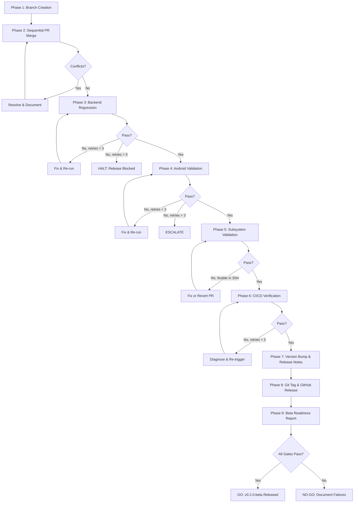
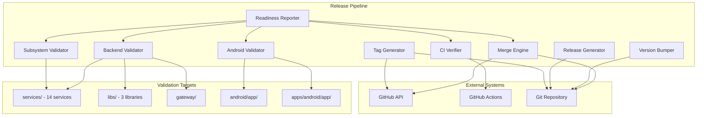
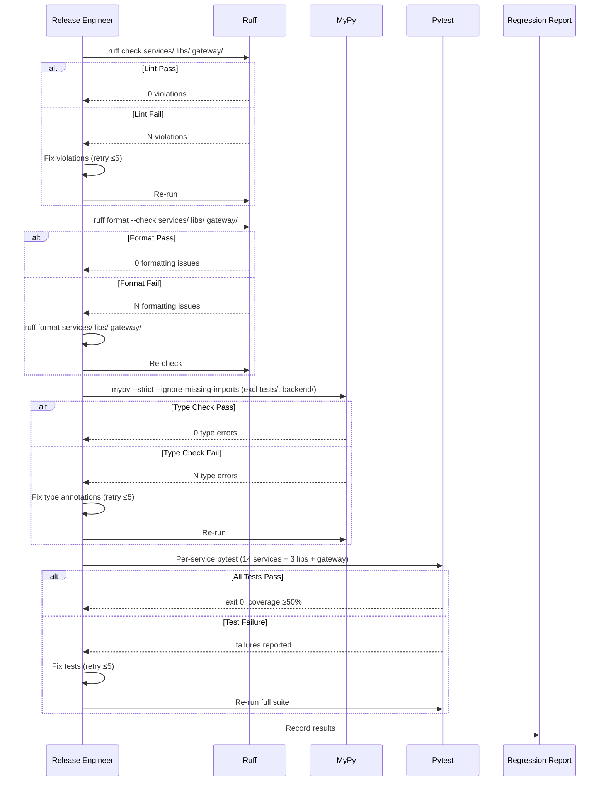
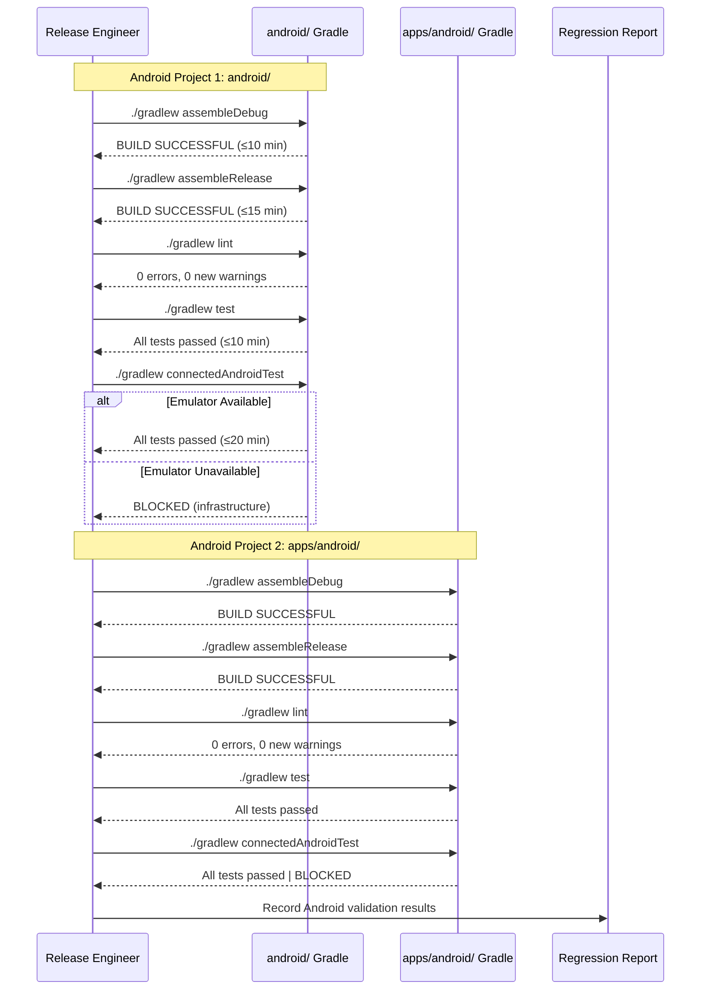
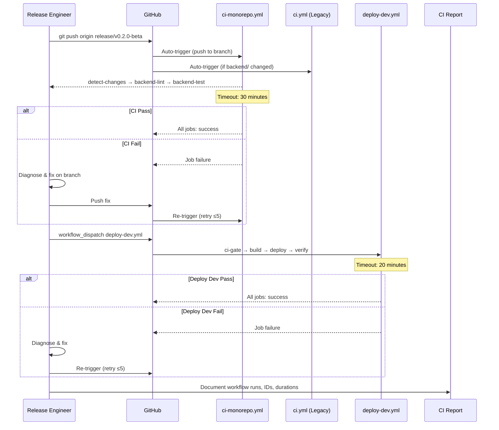
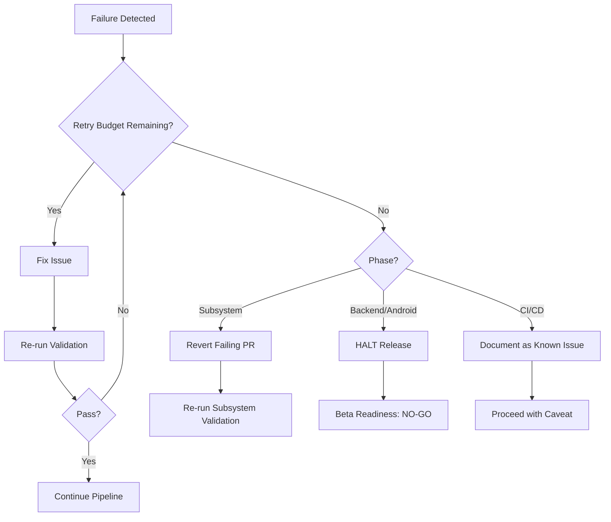

# Technical Design: Release Integration — Merge, Regression & Beta Tag

## Overview

This design document specifies the technical architecture and execution plan for the `v0.2.0-beta` release integration of Sona AI OS. The scope is strictly stabilization and release preparation — no new features are introduced.

The process consolidates 10 pull requests (#67–#76) into a single integration branch (`release/v0.2.0-beta`), executes full regression validation across the Python monorepo (14 services, 3 shared libraries, 1 gateway) and two Android client projects, verifies CI/CD pipelines, bumps version identifiers, generates release artifacts, and creates an annotated Git tag with a corresponding GitHub Release draft.

### Key Technical Constraints

- **Monorepo structure**: 14 Python services under `services/`, 3 libraries under `libs/`, 1 gateway, 2 Android projects (`android/` and `apps/android/`)
- **Python 3.12** with strict MyPy, Ruff linting (17 `sona_*` known-first-party packages)
- **Per-service test execution**: Each service runs `pytest tests/` independently
- **Coverage threshold**: 50% minimum (configured in `pyproject.toml`)
- **Android targets**: Kotlin 1.9.24/2.0.21, Compose, compileSdk 35, Java 17
- **CI**: GitHub Actions with `ci-monorepo.yml` (authoritative), `ci.yml` (legacy), `deploy-dev.yml`, `deploy-prod.yml`
- **Current version**: `1.0.0-rc1` → Target: `v0.2.0-beta`


## Architecture

### Overall Release Architecture

The release process is a sequential pipeline with conditional retry loops. Each phase is a hard gate — failure in any phase blocks progression until resolved or explicitly bypassed via documented exception.




### Branch Strategy

```mermaid
gitgraph
    commit id: "main HEAD"
    branch release/v0.2.0-beta
    checkout release/v0.2.0-beta
    commit id: "merge PR #67"
    commit id: "merge PR #68"
    commit id: "merge PR #69"
    commit id: "merge PR #70"
    commit id: "merge PR #71"
    commit id: "merge PR #72"
    commit id: "merge PR #73"
    commit id: "merge PR #74"
    commit id: "merge PR #75"
    commit id: "merge PR #76"
    commit id: "version bump" tag: "v0.2.0-beta"
```

**Branch Naming**: `release/v0.2.0-beta`
**Base**: HEAD of `main` at process start
**Merge Strategy**: Merge commits only (`git merge --no-ff`). No squash, no rebase — preserves individual PR commit history for traceability.
**Lifecycle**: Integration branch is long-lived until tag creation, then merged back to `main` via a final merge commit.

### Merge Strategy for PRs #67–#76

| Step | Action | Policy |
|------|--------|--------|
| 1 | Create branch from `main` HEAD | `git checkout -b release/v0.2.0-beta main` |
| 2 | Fetch all PR refs | `git fetch origin pull/{N}/head:pr-{N}` for N in 67..76 |
| 3 | Merge sequentially | `git merge --no-ff pr-{N}` in numerical order |
| 4 | Conflict resolution | Preserve both sides; never remove function signatures |
| 5 | Skip policy | Draft, closed, or failing-checks PRs are skipped with documentation |
| 6 | Ancestry verification | `git merge-base --is-ancestor <PR-HEAD> HEAD` for each merged PR |

**Conflict Resolution Rules**:
- Additive conflicts (both branches add to same file): concatenate additions preserving both
- Import conflicts: include all imports from both sides, deduplicate
- Configuration conflicts: use the more permissive/newer configuration
- Never alter existing function signatures, return values, or control flow paths


## Components and Interfaces

### Component Diagram




### Component Interfaces

#### 1. Merge Engine

**Responsibility**: Sequential merge of PRs into integration branch with conflict handling.

**Inputs**:
- Base branch (`main` HEAD SHA)
- PR list: `[67, 68, 69, 70, 71, 72, 73, 74, 75, 76]`
- Skip criteria: draft state, closed status, failing required checks

**Outputs**:
- Integration branch `release/v0.2.0-beta`
- Merge Report (JSON/Markdown)

**Commands**:
```bash
# Branch creation
git checkout -b release/v0.2.0-beta main

# Per-PR merge (repeated for each)
git fetch origin pull/${PR_NUM}/head:pr-${PR_NUM}
git merge --no-ff pr-${PR_NUM} -m "Merge PR #${PR_NUM}: ${PR_TITLE}"

# Ancestry verification
git merge-base --is-ancestor ${PR_HEAD_SHA} HEAD
```

#### 2. Backend Validator

**Responsibility**: Full Python code quality and test regression suite.

**Inputs**: Integration branch state
**Outputs**: Regression Report section (pass/fail per tool, metrics)

**Execution Sequence**:
```bash
# Step 1: Ruff Lint (from repo root)
ruff check services/ libs/ gateway/

# Step 2: Ruff Format Check (from repo root)
ruff format --check services/ libs/ gateway/

# Step 3: MyPy Strict (from repo root)
mypy services/ libs/ gateway/ --strict --ignore-missing-imports --exclude "tests/" --exclude "backend/"

# Step 4: Pytest Per-Service
for service in services/*/; do
  if [ -d "$service/tests" ]; then
    (cd "$service" && pytest tests/ -v --tb=short --cov --cov-fail-under=50)
  fi
done

# Step 5: Pytest Libs
for lib in libs/*/; do
  if [ -d "$lib/tests" ]; then
    (cd "$lib" && pytest tests/ -v --tb=short)
  fi
done

# Step 6: Pytest Gateway
(cd gateway && pytest tests/ -v --tb=short --cov --cov-fail-under=50)
```

**Retry Policy**: Maximum 5 cycles. Fix → re-run full suite.

#### 3. Android Validator

**Responsibility**: Build, lint, and test validation for both Android projects.

**Inputs**: Integration branch state
**Outputs**: Regression Report section (build status, lint, test counts)

**Execution Sequence**:
```bash
# Project 1: android/ (root-level)
cd android/
./gradlew assembleDebug       # ≤10 min
./gradlew assembleRelease     # ≤15 min
./gradlew lint                # 0 errors, 0 new warnings
./gradlew test                # 100% pass, ≤10 min
./gradlew connectedAndroidTest  # 100% pass, ≤20 min

# Project 2: apps/android/
cd apps/android/
./gradlew assembleDebug
./gradlew assembleRelease
./gradlew lint
./gradlew test
./gradlew connectedAndroidTest
```

**Retry Policy**: Maximum 3 attempts. Full sequence re-run on failure.
**Emulator Unavailability**: Mark `connectedAndroidTest` as BLOCKED, not FAILED.


#### 4. Subsystem Validator

**Responsibility**: Cross-cutting integration validation of all 15 subsystems.

**Inputs**: Integration branch (post backend/Android validation pass)
**Outputs**: Per-subsystem pass/fail with test counts

**Subsystem List**:
| # | Subsystem | Expected Location |
|---|-----------|-------------------|
| 1 | Voice | `services/ai-kernel` or `android/voice` |
| 2 | Vision | `apps/android/features/vision` |
| 3 | Dashboard | `apps/android/features/dashboard` |
| 4 | Communication | `apps/android/features/communication` |
| 5 | Connectors | `apps/android/features/connectors` |
| 6 | Memory | `services/memory-os` |
| 7 | Knowledge | `services/knowledge-os` |
| 8 | Agents | `services/workforce-os` |
| 9 | GitHub Integration | `services/mcp-integration` |
| 10 | Google Integration | `services/mcp-integration` |
| 11 | Offline Mode | `apps/android/core` |
| 12 | Notifications | `apps/android/features` |
| 13 | Widgets | `android/widgets` |
| 14 | Overlay | `apps/android/features/overlay` |
| 15 | Quick Settings Tile | `apps/android/features` |

**Validation per subsystem**:
1. Import top-level module / invoke initialization entry point
2. Confirm no unhandled exception within 60 seconds
3. Execute integration test suite in subsystem's test directory (if present)

**Failure Policy**:
- Fix within 30 minutes → re-run
- Cannot fix → revert the offending PR from integration branch, document in report

#### 5. CI/CD Verifier

**Responsibility**: Confirm all GitHub Actions workflows pass on integration branch.

**Workflows to Verify**:
| Workflow | File | Trigger Method | Timeout |
|----------|------|---------------|---------|
| CI Monorepo Pipeline | `ci-monorepo.yml` | Auto on push, or `workflow_dispatch` | 30 min |
| CI Pipeline (Legacy) | `ci.yml` | Auto on push to paths `backend/**` | 30 min |
| Deploy Development | `deploy-dev.yml` | `workflow_dispatch` | 20 min |

**Note**: `deploy-prod.yml` is NOT triggered during this process — it activates on tag push matching `v[0-9]+.[0-9]+.[0-9]+` or `v[0-9]+.[0-9]+.[0-9]+-rc[0-9]+`. The `v0.2.0-beta` tag does NOT match either pattern. This is a known gap that should be addressed post-release.

**Retry Policy**: Maximum 5 re-triggers per workflow.

#### 6. Version Bumper

**Responsibility**: Update version strings across all configuration files.

**Files to Update**:
| File | Field | Old Value | New Value |
|------|-------|-----------|-----------|
| `pyproject.toml` (root) | `project.version` | `1.0.0-rc1` | `0.2.0-beta` |
| `android/app/build.gradle.kts` | `versionName` | `1.0.0-rc1` | `0.2.0-beta` |
| `apps/android/app/build.gradle.kts` | `versionName` | `0.1.0-beta` | `0.2.0-beta` |
| Backend API constants | `API_VERSION` / `app_version` | TBD | `0.2.0-beta` |

#### 7. Release Generator

**Responsibility**: Generate RELEASE_NOTES.md, CHANGELOG.md, and MIGRATION.md.

**Output Structure**:
- `RELEASE_NOTES.md`: Summary, improvements, known limitations
- `CHANGELOG.md`: Keep a Changelog format, `## [v0.2.0-beta]` section with Added/Changed/Fixed/Deprecated
- `MIGRATION.md`: Breaking changes, new env vars, config changes from `1.0.0-rc1`

#### 8. Tag Generator

**Responsibility**: Create annotated Git tag and GitHub Release draft.

**Tag Format**:
```
v0.2.0-beta
```

**Annotation Content**:
- Version: `v0.2.0-beta`
- Date: ISO 8601
- Commit SHA: Full 40-character hash
- Merged PRs: Bulleted list of PR titles with numbers

**GitHub Release**:
- Tag reference: `v0.2.0-beta`
- Pre-release: `true`
- Body: Changelog entries + change summary
- Artifact: Signed release APK (from Android release build)

#### 9. Readiness Reporter

**Responsibility**: Aggregate all validation results into a go/no-go decision.

**Quality Gates** (all must PASS for GO):
1. No unresolved merge conflicts
2. Zero backend test failures
3. Zero Android unit test failures
4. All CI workflows passing
5. Zero Ruff lint violations
6. Zero MyPy type errors
7. No application crashes during test execution
8. Release build successful (backend, Android debug, Android release)


## Data Models

### Merge Report Schema

```json
{
  "report_type": "merge_report",
  "integration_branch": "release/v0.2.0-beta",
  "base_commit": "<main HEAD SHA>",
  "created_at": "ISO 8601 timestamp",
  "prs": [
    {
      "number": 67,
      "title": "PR title",
      "status": "merged | skipped | conflicted-and-resolved",
      "head_sha": "40-char SHA",
      "conflicting_files": ["path/to/file1.py"],
      "resolution_approach": "Preserved both import sets, deduplicated",
      "skip_reason": null
    }
  ],
  "summary": {
    "total_prs": 10,
    "merged": 8,
    "skipped": 1,
    "conflicted_and_resolved": 1
  }
}
```

### Regression Report Schema

```json
{
  "report_type": "regression_report",
  "branch": "release/v0.2.0-beta",
  "commit_sha": "40-char SHA",
  "timestamp": "ISO 8601",
  "backend": {
    "ruff_lint": { "status": "pass|fail", "files_checked": 450, "violations": 0 },
    "ruff_format": { "status": "pass|fail", "files_checked": 450, "violations": 0 },
    "mypy": { "status": "pass|fail", "files_checked": 450, "type_errors": 0 },
    "pytest": {
      "status": "pass|fail",
      "total_tests": 342,
      "passed": 342,
      "failed": 0,
      "pass_rate_pct": 100.0,
      "coverage_pct": 62.5
    },
    "retry_count": 0,
    "tool_versions": {
      "ruff": "0.x.x",
      "mypy": "1.x.x",
      "pytest": "8.x.x"
    }
  },
  "android": {
    "debug_build": { "status": "pass|fail", "duration_sec": 300 },
    "release_build": { "status": "pass|fail", "duration_sec": 540 },
    "lint": { "status": "pass|fail", "errors": 0, "warnings": 0 },
    "unit_tests": { "status": "pass|fail", "total": 120, "passed": 120, "pass_rate_pct": 100.0, "duration_sec": 180 },
    "instrumentation_tests": { "status": "pass|fail|blocked", "total": 45, "passed": 45, "pass_rate_pct": 100.0, "duration_sec": 600 },
    "validation_duration_sec": 1800,
    "commit_sha": "40-char SHA"
  },
  "subsystems": [
    {
      "name": "Voice",
      "status": "pass|fail|reverted|no-integration-tests",
      "integration_tests_executed": 12,
      "integration_tests_passed": 12,
      "timestamp": "ISO 8601",
      "reverted_prs": []
    }
  ]
}
```

### CI Report Schema

```json
{
  "report_type": "ci_report",
  "workflows": [
    {
      "name": "CI Monorepo Pipeline",
      "file": "ci-monorepo.yml",
      "run_id": 12345678,
      "trigger_commit_sha": "40-char SHA",
      "conclusion": "success|failure",
      "jobs": [
        { "name": "backend-lint", "status": "success", "duration_sec": 45 },
        { "name": "backend-test", "status": "success", "duration_sec": 180 }
      ],
      "total_duration": "12m 34s",
      "retrigger_count": 0
    }
  ]
}
```

### Beta Readiness Report Schema

```json
{
  "report_type": "beta_readiness_report",
  "version": "v0.2.0-beta",
  "timestamp": "ISO 8601",
  "quality_gates": [
    { "gate": "No unresolved merge conflicts", "status": "PASS|FAIL", "details": "" },
    { "gate": "Zero backend test failures", "status": "PASS|FAIL", "details": "" },
    { "gate": "Zero Android unit test failures", "status": "PASS|FAIL", "details": "" },
    { "gate": "All CI workflows passing", "status": "PASS|FAIL", "details": "" },
    { "gate": "Zero Ruff lint violations", "status": "PASS|FAIL", "details": "" },
    { "gate": "Zero MyPy type errors", "status": "PASS|FAIL", "details": "" },
    { "gate": "No application crashes", "status": "PASS|FAIL", "details": "" },
    { "gate": "Release build successful", "status": "PASS|FAIL", "details": "" }
  ],
  "summary": {
    "total_prs_merged": 9,
    "total_prs_targeted": 10,
    "total_backend_tests": 342,
    "total_android_tests": 165,
    "test_pass_rate_pct": 100.00,
    "ruff_violations": 0,
    "mypy_errors": 0,
    "build_status": {
      "backend": "PASS",
      "android_debug": "PASS",
      "android_release": "PASS"
    },
    "ci_status": {
      "ci-monorepo": "PASS",
      "ci-legacy": "PASS",
      "deploy-dev": "PASS"
    }
  },
  "failed_gates": [],
  "recommendation": "GO|NO-GO",
  "recommendation_rationale": ""
}
```


## Regression Execution Plan

### Backend Validation Flow



**Execution Order (Backend)**:
1. `ruff check services/ libs/ gateway/` — lint violations block all subsequent steps
2. `ruff format --check services/ libs/ gateway/` — format issues auto-fixable
3. `mypy services/ libs/ gateway/ --strict --ignore-missing-imports --exclude "tests/" --exclude "backend/"` — type safety gate
4. Per-service pytest loop — functional correctness gate

**Key Detail**: Ruff runs from the **repo root** using the root `pyproject.toml` configuration (which defines `known-first-party` for all 17 `sona_*` packages and `src = ["services", "libs", "gateway"]`). MyPy also runs from root with explicit exclusions for `tests/` and `backend/` directories.

### Android Validation Flow



**Android Build Configuration**:
- `android/`: Kotlin 1.9.24, AGP 8.5.0, kapt (Hilt), compileSdk 35, Java 17
- `apps/android/`: Kotlin 2.0.21, AGP 8.5.0, KSP (Hilt), compileSdk 35, Java 17, multi-module (core, features)

**Note**: The `apps/android/` project is the authoritative Android client (multi-module architecture with feature modules). The `android/` project is the original single-module app. Both must validate for release.


### CI/CD Verification Flow



**Workflow Trigger Details**:
- `ci-monorepo.yml`: Triggers on push to `main` or `develop`, and on PRs to those branches. For the integration branch, it may need a `workflow_dispatch` trigger if not auto-triggered.
- `ci.yml`: Only triggers on `backend/**` path changes. May not fire if no legacy backend changes.
- `deploy-dev.yml`: Supports `workflow_dispatch` — manual trigger targeting integration branch.
- `deploy-prod.yml`: **NOT triggered** — pattern `v[0-9]+.[0-9]+.[0-9]+` and `v[0-9]+.[0-9]+.[0-9]+-rc[0-9]+` does not match `v0.2.0-beta`.

### Release Artifact Generation

**Artifacts Produced**:

| Artifact | Location | Format |
|----------|----------|--------|
| Merge Report | `reports/merge-report.md` | Markdown + JSON |
| Regression Report | `reports/regression-report.md` | Markdown + JSON |
| CI Report | `reports/ci-report.md` | Markdown + JSON |
| Release Notes | `RELEASE_NOTES.md` (repo root) | Markdown |
| Changelog | `CHANGELOG.md` (repo root) | Keep a Changelog |
| Migration Notes | `MIGRATION.md` (repo root) | Markdown |
| Beta Readiness Report | `reports/beta-readiness-report.md` | Markdown + JSON |
| Git Tag Report | `reports/git-tag-report.md` | Markdown |
| Signed Release APK | GitHub Release attachment | `.apk` |

**Release Notes Structure**:
```markdown
# Release Notes — v0.2.0-beta

## Summary
[One-paragraph overview of what this release includes]

## New Capabilities
- [PR #67] Feature description
- [PR #68] Feature description
...

## Improvements
- [PR #XX] Behavior change description
...

## Known Limitations
- [#issue] Description
...
```

**Changelog Structure** (Keep a Changelog format):
```markdown
## [v0.2.0-beta] - YYYY-MM-DD

### Added
- Description (#PR)

### Changed
- Description (#PR)

### Fixed
- Description (#PR)

### Deprecated
- Description (#PR)
```


### Git Tagging Strategy

**Tag Creation**:
```bash
# Create annotated tag
git tag -a v0.2.0-beta -m "$(cat <<'EOF'
Release v0.2.0-beta

Version: v0.2.0-beta
Date: $(date -u +%Y-%m-%dT%H:%M:%SZ)
Commit: $(git rev-parse HEAD)

Included Changes:
- PR #67: [title]
- PR #68: [title]
- PR #69: [title]
- PR #70: [title]
- PR #71: [title]
- PR #72: [title]
- PR #73: [title]
- PR #74: [title]
- PR #75: [title]
- PR #76: [title]
EOF
)"

# Verify tag
git tag -v v0.2.0-beta

# Push tag
git push origin v0.2.0-beta
```

**Pre-conditions for Tagging**:
1. All backend validations pass (Ruff, MyPy, Pytest)
2. All Android validations pass (builds, lint, tests)
3. All CI workflows report success
4. Version bumps committed
5. Release notes committed
6. Tag name `v0.2.0-beta` does NOT already exist

**Tag Conflict Check**:
```bash
# Verify tag does not exist
if git rev-parse v0.2.0-beta >/dev/null 2>&1; then
  echo "ERROR: Tag v0.2.0-beta already exists at $(git rev-parse v0.2.0-beta)"
  exit 1
fi
```

**GitHub Release Draft**:
```bash
gh api repos/{owner}/{repo}/releases \
  -f tag_name="v0.2.0-beta" \
  -f name="v0.2.0-beta" \
  -f body="$(cat RELEASE_NOTES.md)" \
  -f prerelease=true \
  -f draft=true
```

## Rollback Strategy

### Rollback Levels

| Level | Trigger | Action | Recovery Time |
|-------|---------|--------|---------------|
| L1: PR Revert | Single PR fails subsystem validation | `git revert --no-edit <merge-commit>` | 5 min |
| L2: Partial Rollback | Multiple PRs fail, but some pass | Revert failed PRs, keep passing ones | 15 min |
| L3: Branch Abandon | >3 PRs fail, integration unstable | Delete branch, restart from `main` | 30 min |
| L4: Tag Delete | Post-tag issue discovered | `git tag -d v0.2.0-beta && git push --delete origin v0.2.0-beta` | 5 min |
| L5: Release Retract | Post-GitHub-Release issue | Delete GitHub Release, delete tag | 10 min |

### Rollback Procedures

**L1 — Single PR Revert**:
```bash
# Identify the merge commit for the failing PR
git log --merges --oneline | grep "PR #${FAILING_PR}"

# Revert the merge commit (preserving history)
git revert -m 1 <merge-commit-sha> --no-edit

# Document in Merge Report
echo "PR #${FAILING_PR} reverted: [reason]" >> reports/merge-report.md
```

**L3 — Branch Abandon**:
```bash
# Ensure no local-only work is lost
git stash

# Switch to main
git checkout main

# Delete integration branch locally and remotely
git branch -D release/v0.2.0-beta
git push origin --delete release/v0.2.0-beta

# Restart process
git checkout -b release/v0.2.0-beta main
```

**L4 — Tag Delete** (only if tag not yet consumed by downstream):
```bash
git tag -d v0.2.0-beta
git push origin --delete v0.2.0-beta
```


## Risk Assessment

| # | Risk | Likelihood | Impact | Mitigation |
|---|------|-----------|--------|------------|
| R1 | Merge conflicts across multiple PRs touching same files | High | Medium | Sequential merge order; preserve both sides; document resolutions |
| R2 | MyPy strict failures from combined type interactions | High | Medium | Fix type annotations on integration branch; 5 retry cycles |
| R3 | Android build failure due to dependency version conflicts between two projects | Medium | High | Align dependency versions; `apps/android/` uses KSP while `android/` uses kapt |
| R4 | Per-service test isolation issues when all services merged together | Medium | Medium | Run tests per-service (not monolithic); check import conflicts |
| R5 | CI workflow not triggering on integration branch (wrong branch pattern) | High | Low | Use `workflow_dispatch` as fallback trigger |
| R6 | Emulator unavailability for instrumentation tests | Medium | Low | Mark as BLOCKED not FAILED; document in report |
| R7 | Tag name conflict (v0.2.0-beta already exists) | Low | High | Pre-check with `git rev-parse`; halt and report if exists |
| R8 | deploy-prod.yml tag pattern doesn't match beta format | Certain | Medium | Document as known gap; does not block beta release |
| R9 | Ruff configuration drift between services | Low | Low | Ruff runs from repo root with unified config |
| R10 | Coverage drops below 50% after merge | Medium | Medium | Identify uncovered code; add tests in retry cycles |
| R11 | Version string format inconsistency across files | Low | Medium | Automated version bump script; verify grep after change |
| R12 | PR in draft/closed state blocking sequential merge | Medium | Low | Skip policy with documentation |

### Risk R8 Detail: deploy-prod.yml Tag Pattern Gap

The production deployment workflow triggers on:
- `v[0-9]+.[0-9]+.[0-9]+` (e.g., `v1.0.0`)
- `v[0-9]+.[0-9]+.[0-9]+-rc[0-9]+` (e.g., `v1.0.0-rc1`)

The tag `v0.2.0-beta` does NOT match either pattern. This means:
- The production deployment pipeline will NOT auto-trigger on tag push
- This is acceptable for a beta release (beta should not auto-deploy to production)
- If production deployment is desired, add pattern: `v[0-9]+.[0-9]+.[0-9]+-beta` to `deploy-prod.yml`
- **Decision**: Do NOT modify `deploy-prod.yml` for this release. Beta deployment is manual.

## Quality Gates

### Gate Definitions

| Gate ID | Gate Name | Pass Criteria | Measured By |
|---------|-----------|---------------|-------------|
| QG-1 | Merge Integrity | All targeted PRs merged or explicitly skipped with documentation | Merge Report |
| QG-2 | Ancestry Verification | Every merged PR's HEAD is an ancestor of integration branch HEAD | `git merge-base --is-ancestor` |
| QG-3 | Ruff Lint Clean | 0 violations in `services/`, `libs/`, `gateway/` | `ruff check` exit code 0 |
| QG-4 | Ruff Format Clean | 0 formatting issues | `ruff format --check` exit code 0 |
| QG-5 | MyPy Clean | 0 type errors (strict mode, excluding tests/ and backend/) | `mypy` exit code 0 |
| QG-6 | Backend Tests Pass | 100% test pass rate, ≥50% coverage | `pytest` exit code 0 |
| QG-7 | Android Debug Build | Build completes without errors within 10 min | Gradle exit code 0 |
| QG-8 | Android Release Build | Build completes without errors within 15 min | Gradle exit code 0 |
| QG-9 | Android Lint | 0 errors, 0 new warnings vs baseline | `./gradlew lint` |
| QG-10 | Android Unit Tests | 100% pass rate within 10 min | `./gradlew test` |
| QG-11 | Android Instrumentation | 100% pass rate within 20 min (or BLOCKED) | `./gradlew connectedAndroidTest` |
| QG-12 | Subsystem Integration | All 15 subsystems pass or documented as no-tests-available | Subsystem validation script |
| QG-13 | CI Monorepo Pass | All jobs succeed within 30 min | GitHub Actions API |
| QG-14 | Deploy Dev Pass | All jobs succeed within 20 min | GitHub Actions API |
| QG-15 | Version Consistency | Same version string in all 4 config files | Grep verification |
| QG-16 | Tag Created | Annotated tag `v0.2.0-beta` exists on branch HEAD | `git describe --exact-match HEAD` |

### Gate Dependencies

```mermaid
graph LR
    QG1[QG-1: Merge] --> QG2[QG-2: Ancestry]
    QG2 --> QG3[QG-3: Lint]
    QG3 --> QG4[QG-4: Format]
    QG4 --> QG5[QG-5: MyPy]
    QG5 --> QG6[QG-6: Tests]
    QG6 --> QG7[QG-7: Debug Build]
    QG7 --> QG8[QG-8: Release Build]
    QG8 --> QG9[QG-9: Lint]
    QG9 --> QG10[QG-10: Unit Tests]
    QG10 --> QG11[QG-11: Instrumentation]
    QG11 --> QG12[QG-12: Subsystems]
    QG12 --> QG13[QG-13: CI Monorepo]
    QG13 --> QG14[QG-14: Deploy Dev]
    QG14 --> QG15[QG-15: Version]
    QG15 --> QG16[QG-16: Tag]
```




## Success Criteria

The release integration is considered successful when ALL of the following are true:

1. **Integration branch exists** with all mergeable PRs (#67–#76) integrated
2. **Zero Ruff violations** (lint + format) across `services/`, `libs/`, `gateway/`
3. **Zero MyPy errors** in strict mode
4. **100% test pass rate** across all backend services with ≥50% coverage
5. **Android debug and release builds** compile without errors (both projects)
6. **Android unit tests** at 100% pass rate
7. **All 15 subsystems** validated (pass or documented as no-tests)
8. **CI workflows** all report success conclusion
9. **Version strings** updated consistently in all 4 configuration files
10. **RELEASE_NOTES.md**, **CHANGELOG.md**, and **MIGRATION.md** generated and committed
11. **Annotated Git tag** `v0.2.0-beta` created on integration branch HEAD
12. **GitHub Release draft** created with pre-release flag and APK artifact
13. **Beta Readiness Report** generated with GO recommendation
14. **All PRs #67–#76** referenced in at least one release document

## Execution Order with Estimated Duration

| Phase | Step | Description | Est. Duration | Cumulative |
|-------|------|-------------|---------------|------------|
| 1 | 1.1 | Create `release/v0.2.0-beta` from `main` HEAD | 1 min | 1 min |
| 1 | 1.2 | Fetch all PR refs (#67–#76) | 2 min | 3 min |
| 2 | 2.1 | Merge PR #67 (check state, merge, verify ancestry) | 3 min | 6 min |
| 2 | 2.2 | Merge PR #68 | 3 min | 9 min |
| 2 | 2.3 | Merge PR #69 | 3 min | 12 min |
| 2 | 2.4 | Merge PR #70 | 3 min | 15 min |
| 2 | 2.5 | Merge PR #71 | 3 min | 18 min |
| 2 | 2.6 | Merge PR #72 | 3 min | 21 min |
| 2 | 2.7 | Merge PR #73 | 3 min | 24 min |
| 2 | 2.8 | Merge PR #74 | 3 min | 27 min |
| 2 | 2.9 | Merge PR #75 | 3 min | 30 min |
| 2 | 2.10 | Merge PR #76 | 3 min | 33 min |
| 2 | 2.11 | Conflict resolution (if any, est. 2 conflicts) | 20 min | 53 min |
| 2 | 2.12 | Generate Merge Report | 5 min | 58 min |
| 3 | 3.1 | Ruff check (lint) | 2 min | 60 min |
| 3 | 3.2 | Ruff format check | 1 min | 61 min |
| 3 | 3.3 | MyPy strict type check | 5 min | 66 min |
| 3 | 3.4 | Pytest per-service (14 services + 3 libs + gateway) | 20 min | 86 min |
| 3 | 3.5 | Backend fixes & retries (estimated 1 retry) | 15 min | 101 min |
| 3 | 3.6 | Generate Backend Regression Report | 3 min | 104 min |
| 4 | 4.1 | Android debug build (both projects) | 15 min | 119 min |
| 4 | 4.2 | Android release build (both projects) | 20 min | 139 min |
| 4 | 4.3 | Android lint (both projects) | 5 min | 144 min |
| 4 | 4.4 | Android unit tests (both projects) | 12 min | 156 min |
| 4 | 4.5 | Android instrumentation tests (both projects) | 30 min | 186 min |
| 4 | 4.6 | Generate Android Regression Report | 3 min | 189 min |
| 5 | 5.1 | Subsystem import/init validation (15 subsystems) | 15 min | 204 min |
| 5 | 5.2 | Subsystem integration test suites | 20 min | 224 min |
| 5 | 5.3 | Fix/revert failed subsystems (if any) | 15 min | 239 min |
| 6 | 6.1 | Push integration branch to remote | 2 min | 241 min |
| 6 | 6.2 | Wait for ci-monorepo.yml completion | 25 min | 266 min |
| 6 | 6.3 | Trigger deploy-dev.yml via workflow_dispatch | 1 min | 267 min |
| 6 | 6.4 | Wait for deploy-dev.yml completion | 18 min | 285 min |
| 6 | 6.5 | Generate CI Report | 3 min | 288 min |
| 7 | 7.1 | Bump version in pyproject.toml | 1 min | 289 min |
| 7 | 7.2 | Bump version in android/app/build.gradle.kts | 1 min | 290 min |
| 7 | 7.3 | Bump version in apps/android/app/build.gradle.kts | 1 min | 291 min |
| 7 | 7.4 | Bump version in backend API constants | 1 min | 292 min |
| 7 | 7.5 | Generate RELEASE_NOTES.md | 10 min | 302 min |
| 7 | 7.6 | Generate CHANGELOG.md entry | 10 min | 312 min |
| 7 | 7.7 | Generate MIGRATION.md | 8 min | 320 min |
| 7 | 7.8 | Commit version + docs | 2 min | 322 min |
| 8 | 8.1 | Verify tag does not exist | 1 min | 323 min |
| 8 | 8.2 | Create annotated Git tag | 2 min | 325 min |
| 8 | 8.3 | Push tag to remote | 1 min | 326 min |
| 8 | 8.4 | Create GitHub Release draft | 3 min | 329 min |
| 8 | 8.5 | Attach release APK artifact | 2 min | 331 min |
| 8 | 8.6 | Generate Git Tag Report | 2 min | 333 min |
| 9 | 9.1 | Aggregate all reports | 5 min | 338 min |
| 9 | 9.2 | Evaluate quality gates | 3 min | 341 min |
| 9 | 9.3 | Generate Beta Readiness Report | 5 min | 346 min |
| 9 | 9.4 | Issue GO/NO-GO recommendation | 1 min | 347 min |

**Total Estimated Duration**: ~5 hours 47 minutes (347 minutes)
**Best Case** (no retries, no conflicts): ~4 hours 30 minutes
**Worst Case** (max retries across all phases): ~8 hours


## Error Handling

### Error Categories and Responses

| Category | Example | Response | Escalation |
|----------|---------|----------|------------|
| **Merge Conflict** | Two PRs modify same function | Preserve both sides, document resolution | If irreconcilable: skip PR, document in report |
| **Lint Failure** | Ruff reports unused import | Auto-fix with `ruff check --fix`, commit | If unfixable: manual fix within retry cycle |
| **Type Error** | MyPy strict mode rejects new code | Add type annotations, fix generics | After 5 retries: halt release |
| **Test Failure** | Pytest assertion fails | Debug, fix test or code, re-run | After 5 retries: halt release |
| **Build Failure** | Gradle dependency resolution fails | Check dependency versions, sync | After 3 retries: escalate |
| **CI Timeout** | Workflow exceeds 30 min | Check for hanging jobs, cancel and re-trigger | After 5 retries: document as known issue |
| **Tag Conflict** | `v0.2.0-beta` already exists | HALT immediately, report existing tag SHA | Manual intervention required |
| **Emulator Issue** | No device for instrumentation tests | Mark BLOCKED, proceed with other validations | Does not block release |
| **GitHub API Error** | Rate limit or 500 response | Exponential backoff, retry 3 times | If persistent: document, proceed manually |

### Retry Budget

| Phase | Max Retries | Retry Scope | Backoff |
|-------|-------------|-------------|---------|
| Backend Validation | 5 | Full suite re-run after fix | None (immediate) |
| Android Validation | 3 | Full sequence re-run after fix | None (immediate) |
| Subsystem Validation | 1 per subsystem | Fix within 30 min or revert PR | Time-boxed |
| CI/CD Workflows | 5 per workflow | Re-trigger after fix | 2 min wait |

### Failure Escalation Path



### Idempotency Guarantees

Each phase is designed for safe re-execution:
- **Merge**: `git merge` on an already-merged PR is a no-op
- **Validation**: Stateless lint/test execution, deterministic results
- **Version bump**: Overwrites existing value (idempotent)
- **Tag creation**: Pre-check prevents duplicate (fails safe)
- **GitHub Release**: Draft mode allows updates without duplication


## Testing Strategy

### Why Property-Based Testing Does Not Apply

This feature is a **release engineering process** — it consists entirely of:
- Infrastructure operations (Git merges, branch creation, tag pushing)
- External service interactions (GitHub Actions, GitHub API)
- Side-effect-only operations (file modifications, version bumps)
- Configuration validation (checking tool output, verifying pass/fail)
- Workflow orchestration (sequential phase execution with retry logic)

There are no pure functions with varying inputs that would benefit from property-based testing. The "inputs" are a fixed set of PRs, and the "outputs" are reports and artifacts. Testing is best served by:
- **Integration tests** with real Git operations on test repositories
- **Smoke tests** for each phase's expected behavior
- **Example-based tests** for specific scenarios (conflict resolution, skip handling)

### Validation Approach

Since this is a release process (not a software feature), validation is built into the execution itself:

#### Phase-Level Validation (Built-in)

| Phase | Validation Method | Pass Criteria |
|-------|-------------------|---------------|
| PR Merge | `git merge-base --is-ancestor` per PR | All merged PR HEADs are ancestors |
| Backend Regression | Tool exit codes (ruff, mypy, pytest) | All exit 0 |
| Android Validation | Gradle exit codes | All exit 0 |
| Subsystem Validation | Python import + init execution | No unhandled exceptions in 60s |
| CI/CD Verification | GitHub Actions API conclusion field | `"success"` for all jobs |
| Version Consistency | `grep` across 4 config files | All show `0.2.0-beta` |
| Tag Integrity | `git describe --exact-match HEAD` | Returns `v0.2.0-beta` |

#### Pre-Flight Checks (Before Execution)

```bash
# 1. Verify main branch is up to date
git fetch origin main
git diff HEAD..origin/main --quiet || echo "WARNING: local main is behind"

# 2. Verify PRs #67-#76 exist and are fetchable
for pr in $(seq 67 76); do
  gh api repos/{owner}/{repo}/pulls/$pr --jq '.state' || echo "PR #$pr not found"
done

# 3. Verify tag does not already exist
! git rev-parse v0.2.0-beta 2>/dev/null

# 4. Verify tools are available and correct versions
ruff --version
mypy --version
pytest --version
```

#### Post-Execution Verification

```bash
# 1. Verify integration branch has correct ancestry
for pr in $(seq 67 76); do
  PR_SHA=$(git rev-parse pr-$pr 2>/dev/null)
  if [ -n "$PR_SHA" ]; then
    git merge-base --is-ancestor $PR_SHA HEAD || echo "FAIL: PR #$pr not ancestor"
  fi
done

# 2. Verify tag points to correct commit
TAG_SHA=$(git rev-parse v0.2.0-beta^{commit})
HEAD_SHA=$(git rev-parse HEAD)
[ "$TAG_SHA" = "$HEAD_SHA" ] || echo "FAIL: Tag does not point to HEAD"

# 3. Verify version strings are consistent
grep -q '"0.2.0-beta"' pyproject.toml
grep -q 'versionName = "0.2.0-beta"' android/app/build.gradle.kts
grep -q 'versionName = "0.2.0-beta"' apps/android/app/build.gradle.kts

# 4. Verify release documents exist
[ -f RELEASE_NOTES.md ] && [ -f CHANGELOG.md ] && [ -f MIGRATION.md ]
```

### Manual Verification Checklist

Before issuing the final GO recommendation, the Release Engineer MUST manually verify:

- [ ] All reports are generated and internally consistent
- [ ] GitHub Release draft is visible and correctly formatted
- [ ] APK artifact is attached and downloadable
- [ ] Tag annotation contains correct PR list
- [ ] No `FIXME` or `TODO` comments introduced by merge resolution
- [ ] CHANGELOG references every PR #67–#76 at least once
- [ ] MIGRATION.md accurately describes breaking changes from `1.0.0-rc1`
