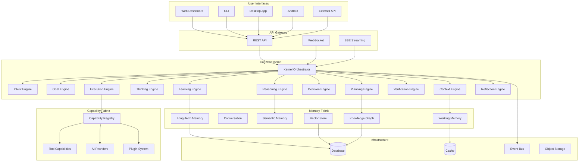
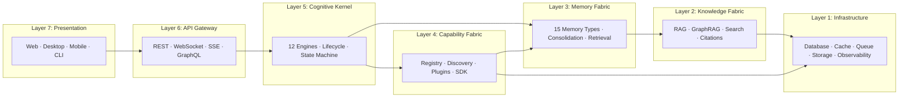
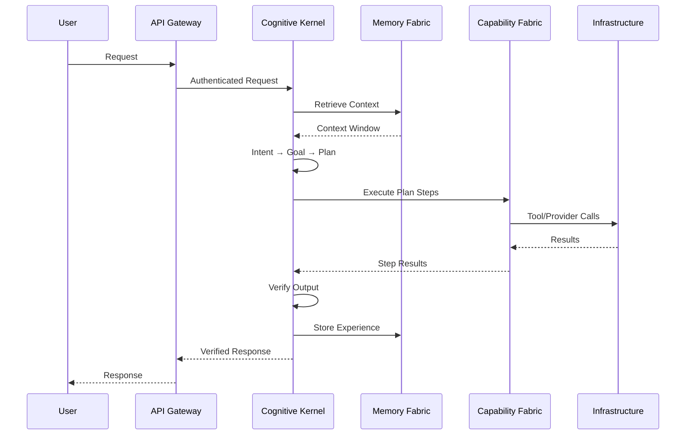

# Section 2 — Enterprise Architecture

## Executive Summary

The enterprise architecture defines Sona AI OS as a layered, event-driven system with strict dependency rules. The architecture separates concerns into 7 layers, each with well-defined responsibilities, communication contracts, and extension points.

---

## High-Level Architecture



---

## Layered Architecture



### Layer Responsibilities

| Layer | Responsibility | May Depend On |
|-------|---------------|---------------|
| 7 — Presentation | User interaction, rendering | Layer 6 only |
| 6 — API Gateway | Protocol translation, auth, rate limiting | Layer 5 |
| 5 — Cognitive Kernel | Orchestration, lifecycle, state | Layers 3, 4 |
| 4 — Capability Fabric | Tool/provider registry, plugin lifecycle | Layers 1, 3 |
| 3 — Memory Fabric | Storage, retrieval, consolidation | Layers 1, 2 |
| 2 — Knowledge Fabric | Search, indexing, RAG pipelines | Layer 1 |
| 1 — Infrastructure | Databases, caching, messaging, observability | External systems |

---

## Dependency Rules (Strict)

1. **Downward only** — Higher layers depend on lower layers, never the reverse
2. **No lateral coupling** — Components at the same layer communicate through the kernel or event bus
3. **Interface contracts** — All cross-layer communication uses abstract interfaces (protocols/ABCs)
4. **No transitive dependencies** — Layer 7 cannot directly access Layer 1
5. **Kernel mediation** — All business logic flows through the Cognitive Kernel

---

## Component Architecture

### Core Components

| Component | Layer | Responsibility |
|-----------|-------|---------------|
| Cognitive Kernel | 5 | Request lifecycle orchestration |
| Intent Engine | 5 | Natural language → structured intent |
| Goal Engine | 5 | Intent → actionable goals with success criteria |
| Context Engine | 5 | World model assembly for current request |
| Thinking Engine | 5 | Chain-of-thought deliberation |
| Reasoning Engine | 5 | Logical inference and argument construction |
| Planning Engine | 5 | Goal → multi-step execution plan |
| Decision Engine | 5 | Plan selection under uncertainty |
| Execution Engine | 5 | Plan → tool invocations with safety controls |
| Verification Engine | 5 | Output quality assurance (10 dimensions) |
| Learning Engine | 5 | Experience extraction and knowledge update |
| Reflection Engine | 5 | Self-assessment and strategy improvement |
| Memory Engine | 5 | Unified memory read/write interface |

### Supporting Components

| Component | Layer | Responsibility |
|-----------|-------|---------------|
| Capability Registry | 4 | Plugin discovery, loading, health |
| Provider Pool | 4 | AI model routing, fallback, cost optimization |
| Tool Registry | 4 | MCP-compatible tool management |
| Knowledge Engine | 2 | RAG, GraphRAG, hybrid search |
| Storage Engine | 1 | Persistence abstraction (SQL, vector, graph) |
| Event Bus | 1 | Async inter-component communication |
| Observability Stack | 1 | Metrics, tracing, logging |

---

## Service Boundaries

Each architectural component is a **bounded context** with:
- A well-defined public interface (protocol/ABC)
- Private internal implementation
- Own persistence (if stateful)
- Own health check endpoint
- Own metrics namespace

Components communicate via:
1. **Synchronous calls** (within the kernel pipeline)
2. **Event bus** (for side-effects and background work)
3. **Shared memory** (for context assembly within a request)

---

## Data Flow



---

## Control Flow

The kernel maintains a **state machine** for every request:

```
RECEIVED → INTENT_ANALYZED → GOAL_SET → CONTEXT_ASSEMBLED
→ THINKING → REASONING → PLANNING → DECIDED
→ EXECUTING → VERIFYING → LEARNING → RESPONDING
```

Each state transition emits an event on the event bus for observability.

---

## Deployment Model

| Mode | Description | Infrastructure |
|------|-------------|---------------|
| Local Development | Single machine, SQLite, in-memory vector | Docker Compose |
| Production (Single Node) | One server, PostgreSQL, Redis | Container (ECS/GKE) |
| Production (Distributed) | Multiple nodes, shared state | Kubernetes |
| Hybrid | Local inference + cloud APIs | Split deployment |
| Offline | Complete local operation, Ollama only | Desktop app |
| Edge | Lightweight, mobile-friendly | Android / ARM |

---

## Design Decision: Event-Driven Side Effects

**Objective:** Decouple the critical path from secondary concerns (logging, learning, metrics).

**Decision:** The kernel emits events for every state transition. Side-effect processors (learning, audit, metrics) subscribe to these events asynchronously.

**Rationale:** Constitution Article 16 requires observability everywhere. Synchronous side-effects would degrade latency. Event-driven design keeps the critical path fast while ensuring nothing is lost.

**Trade-offs:**
- (+) Latency isolation — side effects don't block responses
- (+) Extensibility — new subscribers without kernel changes
- (-) Eventual consistency for learning/metrics
- (-) Event ordering complexity in distributed mode

**Future Extensions:**
- Persistent event log (event sourcing)
- Cross-instance event federation
- Replay for debugging and testing
