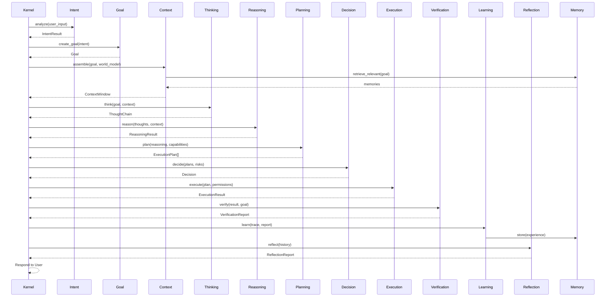

# Section 3 — Cognitive Architecture

## Executive Summary

The Cognitive Architecture defines 12 specialized engines that together form Sona's "mind." Each engine has a single responsibility, communicates through well-defined interfaces, and is orchestrated by the Cognitive Kernel following the constitutional lifecycle.

---

## Engine Overview

```mermaid
graph LR
    INTENT[Intent Engine] --> GOAL[Goal Engine]
    GOAL --> CONTEXT[Context Engine]
    CONTEXT --> THINKING[Thinking Engine]
    THINKING --> REASONING[Reasoning Engine]
    REASONING --> PLANNING[Planning Engine]
    PLANNING --> DECISION[Decision Engine]
    DECISION --> EXEC[Execution Engine]
    EXEC --> VERIFY[Verification Engine]
    VERIFY --> LEARNING[Learning Engine]
    LEARNING --> REFLECT[Reflection Engine]
    REFLECT --> MEMORY[Memory Engine]
    MEMORY -.-> CONTEXT
```

---

## Engine Definitions

### 1. Intent Engine

**Purpose:** Transform raw user input into structured, machine-actionable intent.

| Aspect | Specification |
|--------|--------------|
| Input | Raw text, files, images, context from previous turns |
| Output | `IntentResult(category, entities, confidence, ambiguity_flags)` |
| Method | Pattern matching + LLM classification (configurable) |
| Latency Budget | < 200ms |

**Categories:** question, command, request, clarification, correction, continuation, multi-intent

---

### 2. Goal Engine

**Purpose:** Convert intents into measurable goals with success criteria.

| Aspect | Specification |
|--------|--------------|
| Input | `IntentResult` + user history + project context |
| Output | `Goal(objective, success_criteria, constraints, priority, deadline)` |
| Method | Goal decomposition, constraint inference, priority calculation |
| Latency Budget | < 100ms |

**Responsibilities:** Goal hierarchy management, sub-goal generation, goal lifecycle tracking

---

### 3. Context Engine

**Purpose:** Assemble the complete world model for the current request.

| Aspect | Specification |
|--------|--------------|
| Input | Goal + session state + world model |
| Output | `ContextWindow(memories, files, project_state, capabilities, constraints)` |
| Method | Multi-source retrieval, token budgeting, relevance ranking |
| Latency Budget | < 500ms |

**Sources:** Working memory, conversation history, project memory, knowledge graph, file system state

---

### 4. Thinking Engine

**Purpose:** Deliberate on the problem using chain-of-thought reasoning.

| Aspect | Specification |
|--------|--------------|
| Input | Goal + Context Window |
| Output | `ThoughtChain(steps, insights, hypotheses, uncertainties)` |
| Method | Structured thinking protocols (decomposition, analogy, abstraction) |
| Latency Budget | < 5s (complex tasks) |

---

### 5. Reasoning Engine

**Purpose:** Apply logical inference to validate hypotheses and derive conclusions.

| Aspect | Specification |
|--------|--------------|
| Input | ThoughtChain + domain knowledge |
| Output | `ReasoningResult(conclusions, evidence, confidence, alternatives)` |
| Method | Deductive, inductive, abductive reasoning chains |
| Latency Budget | < 3s |

---

### 6. Planning Engine

**Purpose:** Generate executable multi-step plans from reasoning conclusions.

| Aspect | Specification |
|--------|--------------|
| Input | ReasoningResult + available capabilities + constraints |
| Output | `ExecutionPlan(steps, dependencies, resources, fallbacks)` |
| Method | HTN planning, dependency resolution, resource allocation |
| Latency Budget | < 2s |

---

### 7. Decision Engine

**Purpose:** Select the optimal plan under uncertainty.

| Aspect | Specification |
|--------|--------------|
| Input | Multiple candidate plans + risk assessment |
| Output | `Decision(selected_plan, rationale, confidence, risk_level)` |
| Method | Multi-criteria evaluation, risk-adjusted scoring |
| Latency Budget | < 500ms |

---

### 8. Execution Engine

**Purpose:** Execute plan steps safely with monitoring and control.

| Aspect | Specification |
|--------|--------------|
| Input | ExecutionPlan + permissions + resource budget |
| Output | `ExecutionResult(outputs, metrics, errors, timeline)` |
| Method | Step-by-step execution, checkpoint, retry, rollback |
| Latency Budget | Varies (seconds to minutes) |

---

### 9. Verification Engine

**Purpose:** Validate execution outputs against quality dimensions.

| Aspect | Specification |
|--------|--------------|
| Input | ExecutionResult + Goal + success criteria |
| Output | `VerificationReport(passed, failed, warnings, confidence)` |
| Method | 10 verification pipelines (see Section 11) |
| Latency Budget | < 2s |

---

### 10. Learning Engine

**Purpose:** Extract reusable knowledge from the execution experience.

| Aspect | Specification |
|--------|--------------|
| Input | Full execution trace + verification report |
| Output | `LearningUpdate(new_knowledge, pattern_updates, capability_feedback)` |
| Method | Experience replay, pattern extraction, success/failure classification |
| Latency Budget | Async (does not block response) |

---

### 11. Reflection Engine

**Purpose:** Self-assess performance and identify improvement opportunities.

| Aspect | Specification |
|--------|--------------|
| Input | Execution history + learning updates + metrics |
| Output | `ReflectionReport(strengths, weaknesses, recommendations)` |
| Method | Meta-cognitive analysis, strategy comparison |
| Latency Budget | Async (background process) |

---

### 12. Memory Engine

**Purpose:** Unified interface for all memory operations.

| Aspect | Specification |
|--------|--------------|
| Input | Store/retrieve/search/consolidate requests |
| Output | Memory entries with relevance scores |
| Method | Multi-backend orchestration (see Section 8) |
| Latency Budget | < 200ms (retrieval), async (storage) |

---

## Inter-Engine Communication

---

## Design Decision: Explicit Engine Boundaries

**Objective:** Prevent monolithic reasoning and enable independent engine evolution.

**Decision:** Each engine is a separate module with its own interface contract. Engines never call each other directly — all communication is kernel-mediated.

**Rationale:** Constitution Article 4 establishes the kernel as the sole coordinator. Separate engines enable independent testing, replacement, and observation.

**Trade-offs:**
- (+) Each engine can be replaced (e.g., swap reasoning strategy)
- (+) Complete observability at engine boundaries
- (+) Independent performance optimization per engine
- (-) More interface definitions to maintain
- (-) Slight overhead from kernel mediation

**Future Extensions:**
- LLM-powered engine implementations (dynamic reasoning)
- Specialized engines for specific domains (legal, medical, financial)
- Engine composition for novel cognitive patterns
