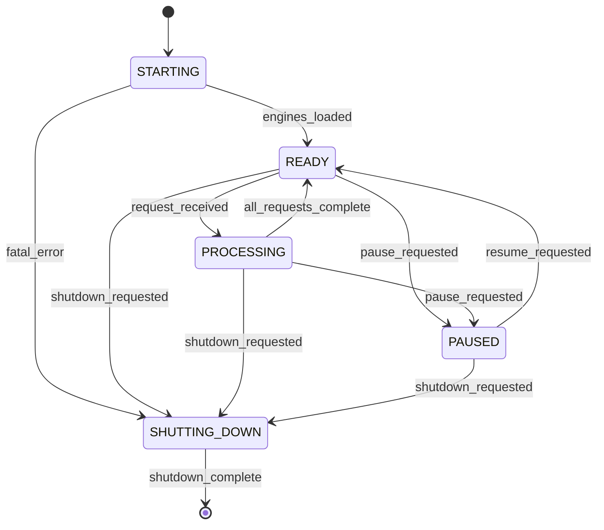
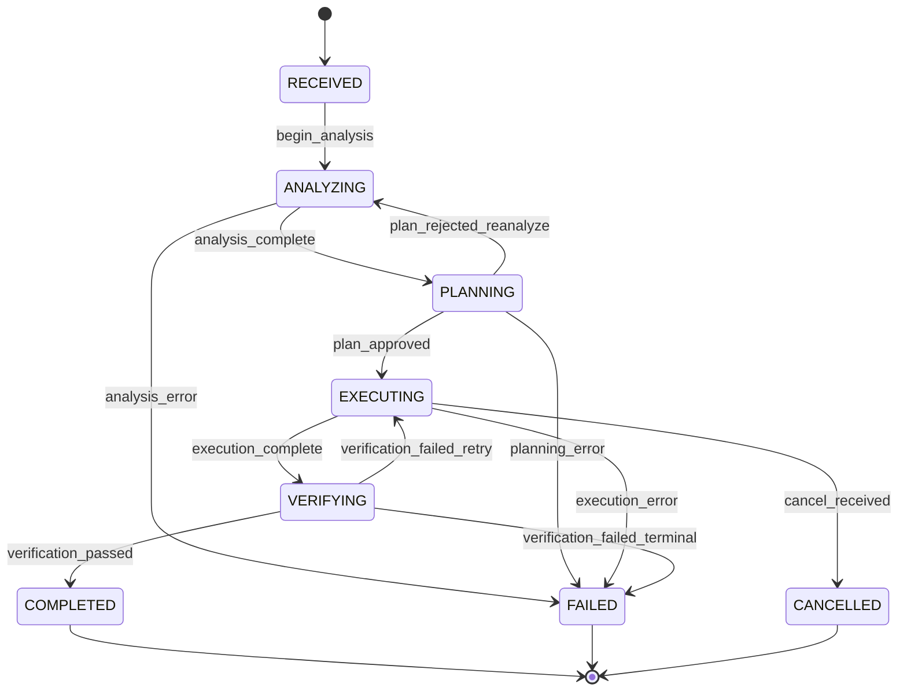

# 04 — Cognitive Kernel

> The Cognitive Kernel is the central orchestration layer of Sona AI OS. It manages the lifecycle of every request, coordinates engines, enforces policies, and emits events that downstream subsystems consume.

---

## Responsibilities

| Concern | Description |
|---------|-------------|
| **Lifecycle Orchestration** | Drives each request through intake, analysis, planning, execution, and verification stages. |
| **State Management** | Maintains a deterministic state machine so that any observer can query current progress. |
| **Event Emission** | Publishes strongly-typed events for every state transition, error, and milestone. |
| **Policy Enforcement** | Gates transitions on configurable policies (budget, security, complexity thresholds). |
| **Engine Coordination** | Dispatches work to registered engines and collects results in a unified protocol. |
| **Resource Governance** | Tracks token budgets, compute time, and concurrency limits per request. |

---

## Public Interfaces

### `process_request(request: KernelRequest) -> KernelResponse`

Entry point for all user-facing interactions. Accepts a structured request envelope and returns a response upon completion or failure.

| Parameter | Type | Description |
|-----------|------|-------------|
| `request_id` | `UUID` | Idempotency key |
| `intent` | `str` | Raw user intent text |
| `context` | `RequestContext` | Session, project, and environment metadata |
| `constraints` | `Constraints` | Budget, deadline, quality thresholds |

### `cancel(request_id: UUID) -> CancellationResult`

Initiates graceful cancellation. Running engines receive a stop signal; partial results are checkpointed.

### `get_state(request_id: UUID) -> KernelState`

Returns the current state of the given request, including sub-task progress and resource consumption.

### `subscribe_events(filter: EventFilter) -> AsyncStream[KernelEvent]`

Opens a streaming subscription for real-time kernel events matching the provided filter.

---

## Internal Interfaces

### Engine Coordination Protocol

Engines communicate with the kernel via a standardized protocol:

```text
Kernel ──► Engine.prepare(task)   → EngineReadyAck
Kernel ──► Engine.execute(task)   → Stream[EngineChunk]
Kernel ──► Engine.cancel(task_id) → EngineCancelAck
Engine ──► Kernel.report(result)  → Ack
Engine ──► Kernel.emit(event)     → Ack
```

**Contract requirements:**

- Engines MUST respond to `prepare` within 500 ms or be marked unhealthy.
- Engines MUST support cancellation at any point during execution.
- Engines MUST emit progress events at least every 5 seconds during active work.
- Engines MUST report terminal state (success/failure) exactly once.

---

## Extension Points

### Custom Engines

Third-party engines implement the `Engine` interface:

| Method | Purpose |
|--------|---------|
| `capabilities()` | Declares supported task types and constraints |
| `prepare(task)` | Validates feasibility, estimates cost |
| `execute(task)` | Performs the work, streams chunks |
| `cancel(task_id)` | Graceful termination |
| `health()` | Reports engine health status |

### Middleware

Middleware intercepts kernel transitions and can modify, delay, or reject them:

- **Pre-transition middleware** — Runs before state change (e.g., budget check, policy gate).
- **Post-transition middleware** — Runs after state change (e.g., audit logging, metrics emit).

### Hooks

Named extension points for cross-cutting concerns:

| Hook | Trigger |
|------|---------|
| `on_request_received` | New request enters the kernel |
| `on_state_changed` | Any state transition |
| `on_engine_selected` | Engine chosen for a task |
| `on_verification_complete` | All verification pipelines finished |
| `on_request_complete` | Final response ready |
| `on_error` | Unrecoverable error encountered |

---

## Kernel Lifecycle

The kernel itself has a lifecycle independent of individual requests:

| State | Description |
|-------|-------------|
| `STARTING` | Loading configuration, initializing engines, connecting to services |
| `READY` | Accepting requests, all engines healthy |
| `PROCESSING` | Actively handling one or more requests |
| `PAUSED` | Draining in-flight work, rejecting new requests (maintenance mode) |
| `SHUTTING_DOWN` | Completing graceful shutdown, persisting state |

---

## Kernel Events

### Lifecycle Events

| Event | Payload | Emitted When |
|-------|---------|--------------|
| `kernel.started` | `{version, engines_loaded}` | Kernel reaches READY |
| `kernel.paused` | `{reason, drain_deadline}` | Kernel enters PAUSED |
| `kernel.shutdown` | `{pending_requests}` | Shutdown initiated |

### Request Events

| Event | Payload | Emitted When |
|-------|---------|--------------|
| `request.received` | `{request_id, intent}` | New request accepted |
| `request.state_changed` | `{request_id, from, to}` | State transition |
| `request.progress` | `{request_id, percent, message}` | Progress update |
| `request.completed` | `{request_id, result, duration}` | Successful completion |
| `request.failed` | `{request_id, error, retryable}` | Terminal failure |
| `request.cancelled` | `{request_id, reason}` | Cancellation confirmed |

### Error Events

| Event | Payload | Emitted When |
|-------|---------|--------------|
| `error.engine_timeout` | `{engine_id, task_id, elapsed}` | Engine exceeds deadline |
| `error.budget_exceeded` | `{request_id, resource, limit}` | Resource cap hit |
| `error.policy_violation` | `{request_id, policy, details}` | Policy gate rejects transition |

---

## Kernel State Machine



### Request State Machine



---

## Design Rationale

- **Event-driven architecture** enables loose coupling between the kernel and consumers.
- **Deterministic state machine** simplifies debugging, replay, and observability.
- **Middleware pattern** allows enterprise customers to inject custom policies without forking.
- **Engine protocol** ensures all intelligence providers are interchangeable and testable in isolation.

---

*Next: [05 — World Model](./05-world-model.md)*
