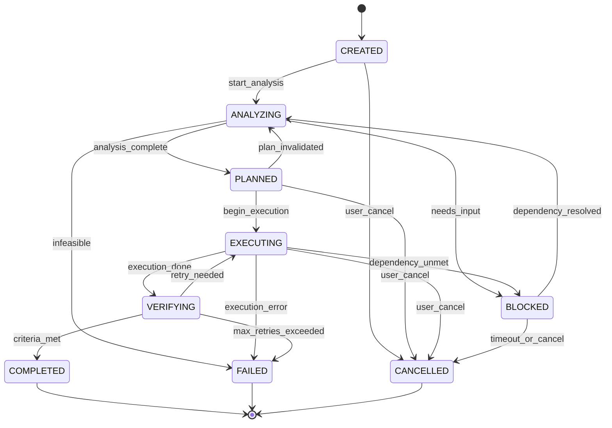

# 06 — Goal Management

> Goal Management governs how Sona AI OS decomposes user intent into trackable, measurable goals, schedules their execution, manages dependencies, and evaluates completion.

---

## Overview

Every user interaction ultimately maps to one or more **Goals**. A Goal is the atomic unit of work commitment — it has clear success criteria, a lifecycle, and measurable outcomes.

| Property | Description |
|----------|-------------|
| **Granularity** | Goals range from atomic (rename a variable) to composite (refactor a module) |
| **Decomposition** | Complex goals are recursively split into sub-goals |
| **Tracking** | Every goal has real-time state, progress, and resource consumption |
| **Accountability** | Goals are assigned to engines and tracked to completion |

---

## Goal Structure

| Field | Type | Description |
|-------|------|-------------|
| `goal_id` | `UUID` | Unique identifier |
| `parent_id` | `UUID | None` | Parent goal (for sub-goals) |
| `title` | `str` | Short human-readable title |
| `description` | `str` | Detailed description of desired outcome |
| `type` | `GoalType` | create, modify, fix, analyze, explain, configure |
| `scope` | `GoalScope` | file, module, project, system |
| `priority` | `Priority` | Computed priority score |
| `state` | `GoalState` | Current lifecycle state |
| `success_criteria` | `list[Criterion]` | Measurable completion conditions |
| `dependencies` | `list[GoalDependency]` | Prerequisite and blocking goals |
| `schedule` | `Schedule` | When to execute |
| `assigned_engine` | `str | None` | Engine responsible for execution |
| `created_at` | `datetime` | Creation timestamp |
| `completed_at` | `datetime | None` | Completion timestamp |
| `metrics` | `GoalMetrics` | Performance and outcome metrics |

---

## Goal Lifecycle

| State | Description | Entry Condition |
|-------|-------------|-----------------|
| `CREATED` | Goal has been registered but not yet analyzed | User intent parsed |
| `ANALYZING` | Understanding scope, feasibility, and requirements | Analysis begins |
| `PLANNED` | Execution plan generated and validated | Plan approved |
| `EXECUTING` | Active work in progress | Plan execution starts |
| `VERIFYING` | Checking results against success criteria | Execution complete |
| `COMPLETED` | All success criteria met | Verification passed |
| `FAILED` | Terminal failure after retry exhaustion | Unrecoverable error |
| `CANCELLED` | User or system cancelled the goal | Cancel request |
| `BLOCKED` | Waiting on dependency or external input | Dependency unmet |

---

## Goal States — Mermaid Diagram



---

## Goal Dependencies

### Dependency Types

| Type | Description | Example |
|------|-------------|---------|
| `PREREQUISITE` | Must complete before this goal can start | "Create file" before "Write tests" |
| `BLOCKING` | Prevents progress until resolved | External approval needed |
| `SOFT` | Preferred but not required ordering | "Read docs" before "Implement" |
| `RESOURCE` | Shares a limited resource | Both goals need GPU |
| `DATA` | Output of one goal is input to another | "Analyze" feeds "Plan" |

### Dependency Resolution

```text
1. Build dependency graph (DAG)
2. Detect cycles → reject with error
3. Topological sort for execution order
4. Identify parallelizable groups (no mutual dependencies)
5. Schedule groups for concurrent execution
6. Monitor for dynamic dependency changes
```

### Deadlock Prevention

- Maximum dependency chain depth: 10 levels
- Cycle detection on every dependency addition
- Timeout on blocked goals: configurable (default 5 minutes)
- Automatic escalation to user on unresolvable blocks

---

## Goal Prioritization

Priority is computed as a weighted score across four dimensions:

| Dimension | Weight | Range | Description |
|-----------|--------|-------|-------------|
| **Urgency** | 0.30 | 1–10 | Time sensitivity (deadline proximity) |
| **Importance** | 0.35 | 1–10 | Business value and user impact |
| **Effort** | 0.20 | 1–10 | Inverse — lower effort = higher priority |
| **Risk** | 0.15 | 1–10 | Inverse — lower risk = higher priority |

**Priority Score** = `(urgency × 0.30) + (importance × 0.35) + ((10 - effort) × 0.20) + ((10 - risk) × 0.15)`

### Priority Bands

| Band | Score Range | Behavior |
|------|-------------|----------|
| CRITICAL | 8.0 – 10.0 | Immediate execution, preempts other work |
| HIGH | 6.0 – 7.9 | Next in queue, minimal delay |
| MEDIUM | 4.0 – 5.9 | Standard scheduling |
| LOW | 2.0 – 3.9 | Background execution when idle |
| DEFERRED | 0.0 – 1.9 | Queued for future consideration |

### Dynamic Re-prioritization

Priority is recalculated when:
- Deadline approaches (urgency increases)
- Dependencies complete (effort decreases)
- Risk assessment changes
- User explicitly re-prioritizes

---

## Goal Scheduling

### Schedule Types

| Type | Description | Use Case |
|------|-------------|----------|
| `IMMEDIATE` | Execute as soon as possible | User-initiated requests |
| `DEFERRED` | Execute after specified delay or condition | Background optimization |
| `RECURRING` | Execute on a schedule (cron-like) | Periodic code analysis |
| `EVENT_TRIGGERED` | Execute when specific event fires | On file save, on commit |
| `BATCH` | Group with similar goals for efficiency | Multiple file formatting |

### Scheduling Constraints

| Constraint | Description |
|------------|-------------|
| `max_concurrent` | Maximum parallel goals per session |
| `resource_affinity` | Prefer specific engine or resource |
| `time_window` | Only execute during specified hours |
| `cool_down` | Minimum interval between recurring executions |
| `preemption_allowed` | Whether higher-priority goals can interrupt |

---

## Goal Completion

### Success Criteria Evaluation

Each goal defines one or more measurable success criteria:

| Criterion Type | Description | Example |
|----------------|-------------|---------|
| `FILE_EXISTS` | A specific file must exist | "tests/test_auth.py exists" |
| `TESTS_PASS` | Test suite passes | "All unit tests green" |
| `CODE_COMPILES` | No compilation errors | "mypy passes with no errors" |
| `PATTERN_MATCH` | Output matches expected pattern | "Function returns expected type" |
| `METRIC_THRESHOLD` | Metric within bounds | "Coverage > 80%" |
| `HUMAN_APPROVAL` | User confirms satisfaction | "User accepts the change" |
| `NO_REGRESSION` | Existing tests still pass | "No test regressions" |

### Completion Protocol

```text
1. All execution tasks report done
2. Collect execution outputs
3. Evaluate each success criterion
4. If ALL criteria pass → COMPLETED
5. If ANY criterion fails:
   a. Check retry budget
   b. If retries available → back to EXECUTING with feedback
   c. If retries exhausted → FAILED
6. Emit completion event with full metrics
```

---

## Goal Metrics

Metrics collected for every goal, used for system learning and optimization:

| Metric | Type | Description |
|--------|------|-------------|
| `time_to_complete` | `Duration` | Wall-clock time from CREATED to terminal state |
| `execution_time` | `Duration` | Time spent in EXECUTING state |
| `analysis_time` | `Duration` | Time spent in ANALYZING state |
| `planning_time` | `Duration` | Time spent in PLANNED state |
| `verification_time` | `Duration` | Time spent in VERIFYING state |
| `retry_count` | `int` | Number of execution retries |
| `success_rate` | `float` | Historical success rate for similar goals |
| `tokens_consumed` | `int` | Total tokens used |
| `cost` | `float` | Total monetary cost |
| `confidence` | `float` | System's confidence in the outcome (0.0–1.0) |
| `user_satisfaction` | `float | None` | User rating if provided |

### Metrics Aggregation

Metrics are aggregated at multiple levels:
- **Per-goal**: Individual goal performance
- **Per-type**: Average metrics by goal type (create, fix, analyze, etc.)
- **Per-session**: Session-level rollups
- **Per-project**: Project-level trends over time
- **System-wide**: Global performance baselines

---

## Design Considerations

- Goals are **immutable once completed** — history is never rewritten.
- Sub-goal failure does **not** automatically fail the parent — the parent can retry with a different strategy.
- Goal metrics feed into the **Experience Memory** for future planning improvements.
- The scheduler respects **fairness** — no single user or session can monopolize resources.

---

*Next: [07 — Capability Fabric](./07-capability-fabric.md)*
