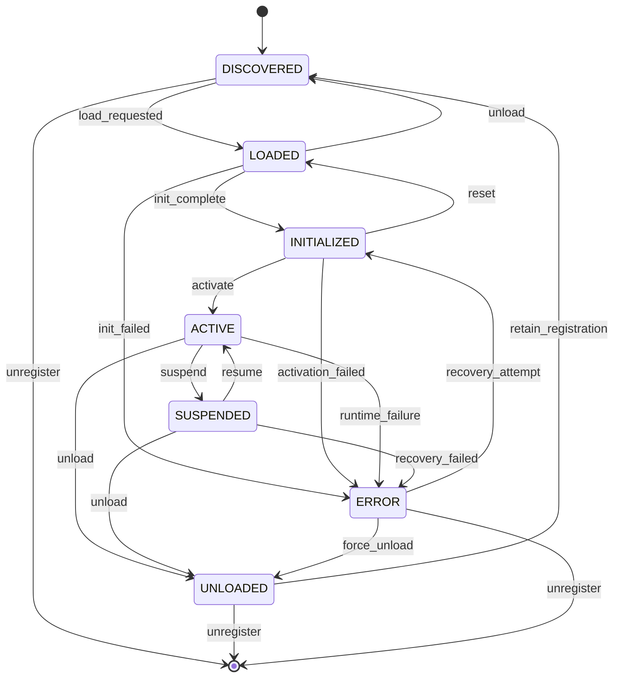

# 07 — Capability Fabric

> The Capability Fabric is the extensibility layer of Sona AI OS. It provides a unified framework for discovering, loading, managing, and monitoring capabilities — from built-in tools to third-party plugins and marketplace extensions.

---

## Overview

A **Capability** is any discrete unit of functionality that the system can invoke. Capabilities are the "muscles" of the AI — they translate plans into actions.

| Property | Description |
|----------|-------------|
| **Uniform Interface** | All capabilities implement the same contract regardless of origin |
| **Lazy Loading** | Capabilities are loaded on-demand to minimize resource footprint |
| **Sandboxed** | Each capability runs in an isolated context with explicit permissions |
| **Versioned** | SemVer-based versioning with compatibility guarantees |
| **Observable** | Health, performance, and usage are continuously monitored |

---

## Capability Registry

The registry is the authoritative catalog of all known capabilities.

### Registry Structure

| Field | Type | Description |
|-------|------|-------------|
| `capability_id` | `UUID` | Unique identifier |
| `name` | `str` | Human-readable name |
| `namespace` | `str` | Organizational namespace (e.g., `sona.core`, `community.tools`) |
| `version` | `SemVer` | Current version |
| `type` | `CapabilityType` | tool, provider, integration, engine, plugin |
| `manifest` | `Manifest` | Full capability manifest |
| `state` | `LifecycleState` | Current lifecycle state |
| `health` | `HealthStatus` | Last known health |
| `metadata` | `CapabilityMeta` | Tags, categories, ratings |

### Registration Protocol

```text
1. Capability submits manifest to registry
2. Registry validates manifest schema
3. Registry checks for conflicts (namespace, permissions)
4. Registry verifies digital signature (if required)
5. Capability assigned UUID and registered as DISCOVERED
6. Discovery event emitted to interested subscribers
```

### Registry Operations

| Operation | Description |
|-----------|-------------|
| `register(manifest)` | Add a new capability to the registry |
| `unregister(id)` | Remove a capability (graceful unload first) |
| `query(filter)` | Search capabilities by type, tag, permission |
| `resolve(name, version_range)` | Find best-matching version |
| `list_updates()` | Check for available updates |

---

## Discovery Protocol

Capabilities are discovered through multiple channels:

### Filesystem Scan

- Scans configured plugin directories on startup
- Watches directories for hot-reload on file change
- Reads `capability.manifest.json` from each plugin root

### Package Registry

- Queries configured package registries (internal, PyPI, npm)
- Resolves dependencies transitively
- Verifies integrity via checksums

### Remote Marketplace

- Connects to Sona Marketplace API
- Fetches catalog updates periodically
- Downloads and installs on user request
- Supports private/enterprise marketplaces

### Discovery Priority

```text
1. Built-in capabilities (highest priority)
2. Project-local plugins (.sona/plugins/)
3. User-global plugins (~/.sona/plugins/)
4. Installed marketplace extensions
5. Remote marketplace (on-demand)
```

---

## Loading

### Lazy Loading Strategy

Capabilities are loaded only when first invoked or explicitly pre-loaded:

| Strategy | Trigger | Use Case |
|----------|---------|----------|
| `ON_DEMAND` | First invocation | Most capabilities |
| `EAGER` | System startup | Core capabilities |
| `PREDICTIVE` | Anticipated need | Based on user patterns |
| `MANUAL` | Explicit user request | Optional heavy capabilities |

### Dependency Resolution

```text
1. Parse capability dependencies from manifest
2. Build dependency graph (DAG)
3. Detect circular dependencies → reject
4. Resolve version constraints (SemVer ranges)
5. Load dependencies bottom-up
6. Inject resolved dependencies into capability
```

### Sandboxing

Each capability runs within a sandbox that enforces:

| Boundary | Enforcement |
|----------|-------------|
| **Filesystem** | Read/write restricted to declared paths |
| **Network** | Allowlisted domains and ports only |
| **Compute** | CPU time limits, memory caps |
| **Permissions** | Only granted permissions are available |
| **Secrets** | Access only to explicitly shared secrets |

---

## Lifecycle

| State | Description |
|-------|-------------|
| `DISCOVERED` | Manifest parsed, capability known but not loaded |
| `LOADED` | Code/module loaded into memory |
| `INITIALIZED` | Configuration applied, resources allocated |
| `ACTIVE` | Ready to handle invocations |
| `SUSPENDED` | Temporarily paused (health issue, rate limit, maintenance) |
| `UNLOADED` | Resources released, module unloaded |
| `ERROR` | Failed state requiring intervention |

### Lifecycle Diagram



---

## Health Monitoring

### Health Check Protocol

| Check | Frequency | Timeout | Description |
|-------|-----------|---------|-------------|
| **Heartbeat** | 30s | 5s | Basic liveness ping |
| **Performance** | 60s | 10s | Latency and throughput sample |
| **Error Rate** | 60s | — | Rolling error percentage |
| **Resource Usage** | 30s | — | Memory, CPU consumption |

### Health Status

| Status | Criteria | Action |
|--------|----------|--------|
| `HEALTHY` | All checks pass, error rate < 1% | Normal operation |
| `DEGRADED` | Elevated latency or error rate 1–5% | Alert, monitor closely |
| `UNHEALTHY` | Error rate > 5% or failed heartbeat | Suspend, attempt recovery |
| `DEAD` | No heartbeat for 3 consecutive checks | Unload, notify admin |

### Circuit Breaker

When a capability exceeds error thresholds:

```text
CLOSED (normal) ──[error threshold exceeded]──► OPEN (reject all)
OPEN ──[cool-down elapsed]──► HALF-OPEN (allow probe request)
HALF-OPEN ──[probe succeeds]──► CLOSED
HALF-OPEN ──[probe fails]──► OPEN
```

---

## Plugin SDK

### Interface Contract

Every capability must implement:

| Method | Description |
|--------|-------------|
| `manifest() -> Manifest` | Returns capability metadata and requirements |
| `initialize(config) -> None` | One-time setup with provided configuration |
| `execute(input) -> Output` | Perform the capability's primary function |
| `health() -> HealthStatus` | Report current health |
| `shutdown() -> None` | Graceful cleanup |

### Manifest Schema

```text
{
  "name": "string",
  "namespace": "string",
  "version": "semver",
  "description": "string",
  "type": "tool | provider | integration | engine | plugin",
  "permissions": ["filesystem.read", "network.http"],
  "dependencies": [{"name": "...", "version": ">=1.0.0"}],
  "configuration": { ... schema ... },
  "inputs": { ... schema ... },
  "outputs": { ... schema ... }
}
```

### Packaging

- Standard package format: `.sona-plugin` (zip archive)
- Required contents: manifest, code, README, LICENSE
- Optional: tests, examples, documentation
- Signed with developer key for authenticity

### Distribution

| Channel | Description |
|---------|-------------|
| Local file | Direct installation from filesystem |
| Git repository | Clone and install from git URL |
| Package registry | Publish to npm/PyPI with sona metadata |
| Marketplace | Publish to Sona Marketplace |

---

## Versioning

### SemVer Policy

| Change Type | Version Bump | Example |
|-------------|--------------|---------|
| Breaking interface change | MAJOR | 1.x.x → 2.0.0 |
| New feature, backward compatible | MINOR | 1.1.x → 1.2.0 |
| Bug fix, no interface change | PATCH | 1.1.1 → 1.1.2 |

### Compatibility Matrix

| Consumer Version | Provider Version | Compatible |
|-----------------|-----------------|------------|
| ^1.0.0 | 1.0.0 – 1.x.x | Yes |
| ^1.0.0 | 2.0.0 | No (breaking) |
| >=1.2.0 | 1.3.0 | Yes |
| >=1.2.0 | 1.1.0 | No (too old) |

### Migration Support

- Deprecated APIs emit warnings for one MINOR cycle
- Removed APIs require MAJOR version bump
- Migration guides auto-generated from changelog

---

## Marketplace

### Operations

| Operation | Description |
|-----------|-------------|
| **Publish** | Submit capability package with manifest and metadata |
| **Search** | Full-text and faceted search across marketplace |
| **Install** | Download, verify, and register capability |
| **Update** | Check and apply available updates |
| **Rate** | Submit star rating (1–5) |
| **Review** | Submit written review with approval workflow |
| **Report** | Flag capability for policy violation |

### Quality Gates

Before publication, capabilities must pass:

- Schema validation (manifest completeness)
- Security scan (no known vulnerabilities)
- Permission audit (no excessive permissions)
- Test execution (provided tests must pass)
- Documentation check (README and API docs present)

### Trust Levels

| Level | Badge | Requirements |
|-------|-------|--------------|
| Unverified | — | Passed automated checks only |
| Verified | Checkmark | Developer identity confirmed |
| Certified | Star | Full security audit + team review |
| Official | Shield | Published by Sona team |

---

*Next: [08 — Memory Fabric](./08-memory-fabric.md)*
