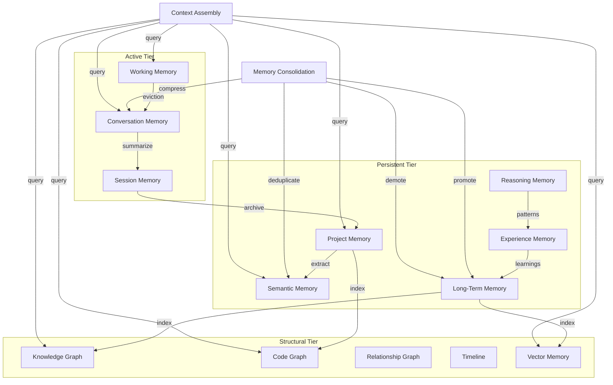

# 08 — Memory Fabric

> The Memory Fabric is Sona AI OS's comprehensive memory system. It provides 15 distinct memory types organized into tiers, enabling the system to maintain context, learn from experience, and efficiently retrieve relevant knowledge.

---

## Overview

Memory is organized into three tiers based on persistence and access patterns:

| Tier | Memory Types | Persistence | Access Speed |
|------|-------------|-------------|--------------|
| **Active** | Working, Conversation, Session | Volatile | < 1 ms |
| **Persistent** | Project, Semantic, Reasoning, Experience, Long-Term | Durable | < 50 ms |
| **Structural** | Knowledge Graph, Code Graph, Relationship Graph, Timeline, Vector | Indexed | < 100 ms |

---

## Working Memory

The token-budgeted scratchpad for the current reasoning step.

| Property | Value |
|----------|-------|
| **Scope** | Single reasoning step |
| **Capacity** | Configurable (default: 8,192 tokens) |
| **Eviction Policy** | LRU with importance weighting |
| **Persistence** | None — rebuilt each step |

### Eviction Strategy

```text
Priority Score = relevance × recency × importance
When capacity exceeded:
  1. Score all entries
  2. Evict lowest-scored entries until within budget
  3. Emit eviction events for audit trail
  4. Demoted entries move to Conversation Memory
```

### Content Types

- Current goal and sub-goals
- Relevant code snippets
- Recent tool outputs
- Active reasoning chain
- User preferences affecting this step

---

## Conversation Memory

Per-session dialog history with the user.

| Property | Value |
|----------|-------|
| **Scope** | Single conversation |
| **Capacity** | Last 100 turns (configurable) |
| **Format** | Structured turn objects (role, content, metadata) |
| **Summarization** | Older turns compressed to summaries |

### Turn Structure

| Field | Description |
|-------|-------------|
| `role` | user, assistant, system, tool |
| `content` | Message content |
| `timestamp` | When the turn occurred |
| `tokens` | Token count |
| `references` | Files, tools, or memories referenced |

---

## Session Memory

Cross-conversation state within a single session.

| Property | Value |
|----------|-------|
| **Scope** | User session (may span multiple conversations) |
| **Content** | Decisions made, preferences expressed, context established |
| **Lifetime** | Until session ends or configurable TTL |
| **Persistence** | Durable within session, archived after |

### Session State

- Active project context
- User-stated preferences for this session
- Accumulated decisions and their rationale
- Files modified during the session
- Cumulative resource usage

---

## Project Memory

Repository-scoped knowledge that persists across sessions.

| Property | Value |
|----------|-------|
| **Scope** | Single project/repository |
| **Content** | Architecture decisions, patterns, conventions, team preferences |
| **Lifetime** | Permanent (until explicitly cleared) |
| **Storage** | Project-local database (`.sona/memory/`) |

### Stored Knowledge

- Architecture Decision Records (ADRs)
- Coding conventions and style guides
- Common patterns and anti-patterns in the codebase
- Build and deployment procedures
- Team member roles and expertise areas
- Historical issue resolutions

---

## Semantic Memory

Factual knowledge, concepts, and their relationships.

| Property | Value |
|----------|-------|
| **Scope** | Global (shared across projects) |
| **Content** | Facts, definitions, API knowledge, best practices |
| **Retrieval** | Embedding-based similarity search |
| **Updates** | Append-only with versioning |

### Entry Structure

| Field | Description |
|-------|-------------|
| `fact` | The knowledge statement |
| `source` | Where this knowledge was acquired |
| `confidence` | Certainty level (0.0–1.0) |
| `domain` | Knowledge domain (language, framework, tool) |
| `last_validated` | When this fact was last confirmed |

---

## Reasoning Memory

Past reasoning chains and successful strategies.

| Property | Value |
|----------|-------|
| **Scope** | Global |
| **Content** | Complete reasoning traces with outcomes |
| **Retrieval** | By problem pattern similarity |
| **Learning** | Strategies that succeed are promoted |

### Reasoning Entry

| Field | Description |
|-------|-------------|
| `problem_pattern` | Abstracted problem type |
| `strategy` | Approach taken |
| `steps` | Detailed reasoning steps |
| `outcome` | SUCCESS, PARTIAL, FAILURE |
| `lessons` | Extracted learnings |
| `applicability` | Contexts where this strategy works |

---

## Experience Memory

Execution outcomes and success/failure patterns.

| Property | Value |
|----------|-------|
| **Scope** | Per-project and global |
| **Content** | What was attempted, what happened, what was learned |
| **Pattern Extraction** | Automatic clustering of similar outcomes |
| **Feedback Loop** | Failures inform future risk assessment |

### Experience Entry

| Field | Description |
|-------|-------------|
| `action` | What was attempted |
| `context` | Conditions at the time |
| `outcome` | Result (success/failure/partial) |
| `root_cause` | Why it failed (if applicable) |
| `recovery` | How it was fixed |
| `frequency` | How often this pattern occurs |

---

## Long-Term Memory

Permanent, importance-scored knowledge base.

| Property | Value |
|----------|-------|
| **Scope** | Global |
| **Capacity** | Unlimited (storage-bound) |
| **Scoring** | Importance score determines retrieval priority |
| **Decay** | Unused memories decay in importance over time |
| **Promotion** | Frequently accessed memories gain importance |

### Importance Scoring

```text
importance = base_importance 
  + access_frequency_bonus 
  + recency_bonus 
  - decay_penalty

Decay: importance -= 0.01 per day without access
Promotion: importance += 0.1 per access (capped at 1.0)
Threshold: memories below 0.1 are archived
```

---

## Knowledge Graph

Entity-relationship graph for structured knowledge.

| Property | Value |
|----------|-------|
| **Nodes** | Entities (concepts, files, people, tools) |
| **Edges** | Typed relationships with properties |
| **Queries** | Graph traversal, path finding, subgraph extraction |
| **Storage** | Property graph database |

### Node Types

| Type | Examples |
|------|----------|
| `Concept` | "REST API", "dependency injection", "microservices" |
| `Technology` | "Python 3.12", "FastAPI", "PostgreSQL" |
| `Person` | Team members, authors |
| `File` | Source files, configurations |
| `Decision` | Architecture decisions, trade-offs |

### Edge Types

| Type | Description |
|------|-------------|
| `DEPENDS_ON` | Technical dependency |
| `IMPLEMENTS` | Realizes a concept |
| `AUTHORED_BY` | Created by person |
| `RELATED_TO` | General association |
| `SUPERSEDES` | Replaces previous version |

---

## Code Graph

Source code structure as a navigable graph.

| Property | Value |
|----------|-------|
| **Nodes** | Functions, classes, modules, packages |
| **Edges** | Calls, imports, inherits, implements |
| **Indexing** | Incremental on file change |
| **Queries** | Call graphs, dependency chains, impact analysis |

### Supported Analyses

- **Call graph**: Who calls this function?
- **Dependency chain**: What depends on this module?
- **Impact analysis**: What breaks if I change this?
- **Dead code detection**: What is never called?
- **Circular dependency detection**: Where are cycles?
- **Complexity hotspots**: Where is cognitive complexity highest?

---

## Relationship Graph

User preferences, project associations, and contextual links.

| Property | Value |
|----------|-------|
| **Scope** | Per-user, per-project |
| **Content** | Preferences, associations, usage patterns |
| **Updates** | Inferred from behavior, confirmed by user |

### Relationship Types

- User → prefers → Technology
- User → works-on → Project
- Project → uses → Technology
- Project → follows → Convention
- File → relates-to → Concept
- Task → assigned-to → Engine

---

## Timeline

Temporal event log for activity tracking.

| Property | Value |
|----------|-------|
| **Scope** | Per-session, per-project, global |
| **Content** | Timestamped events with metadata |
| **Queries** | Time range, event type, entity filter |
| **Retention** | Configurable (default: 90 days) |

### Event Categories

| Category | Examples |
|----------|----------|
| `goal` | Created, completed, failed |
| `file` | Created, modified, deleted |
| `conversation` | Started, message, ended |
| `system` | Started, error, recovery |
| `capability` | Invoked, succeeded, failed |

---

## Vector Memory

Embedding-based storage for similarity search.

| Property | Value |
|----------|-------|
| **Storage** | Vector database (configurable backend) |
| **Dimensions** | 768–1536 (model-dependent) |
| **Index** | HNSW for approximate nearest neighbors |
| **Queries** | K-NN search, filtered search, hybrid |

### Embedding Sources

| Source | Embedding Strategy |
|--------|-------------------|
| Code chunks | Function/class-level embeddings |
| Documentation | Paragraph-level embeddings |
| Conversations | Turn-level embeddings |
| Knowledge | Fact-level embeddings |
| Reasoning | Strategy-level embeddings |

---

## Memory Consolidation

Process of compressing, summarizing, and promoting/demoting memories.

### Operations

| Operation | Description | Trigger |
|-----------|-------------|---------|
| **Compression** | Reduce verbose memories to essential facts | Memory pressure |
| **Summarization** | Generate summaries of conversation/session history | Session end |
| **Promotion** | Move frequently-accessed short-term to long-term | Access threshold |
| **Demotion** | Move unused long-term to archive | Decay threshold |
| **Deduplication** | Merge equivalent memories | Periodic sweep |
| **Validation** | Check memories against current reality | Project change |

### Consolidation Schedule

```text
- Real-time: Working memory eviction
- Per-turn: Conversation summary updates
- Per-session: Session memory archival
- Daily: Long-term memory decay + promotion
- Weekly: Knowledge graph reconciliation
- Monthly: Full deduplication sweep
```

---

## Context Assembly

Multi-source retrieval that builds the optimal context for each reasoning step.

### Assembly Pipeline

```text
1. Parse current goal and identify information needs
2. Query relevant memory types in parallel
3. Rank results by relevance, recency, importance
4. Budget tokens across sources
5. Assemble final context within token limit
6. Track provenance for citation
```

### Token Budgeting

| Source | Default Budget Share |
|--------|---------------------|
| Working Memory | 30% |
| Relevant Code | 25% |
| Conversation History | 20% |
| Retrieved Knowledge | 15% |
| System Context | 10% |

---

## Memory Type Relationships



---

*Next: [09 — Knowledge Fabric](./09-knowledge-fabric.md)*
