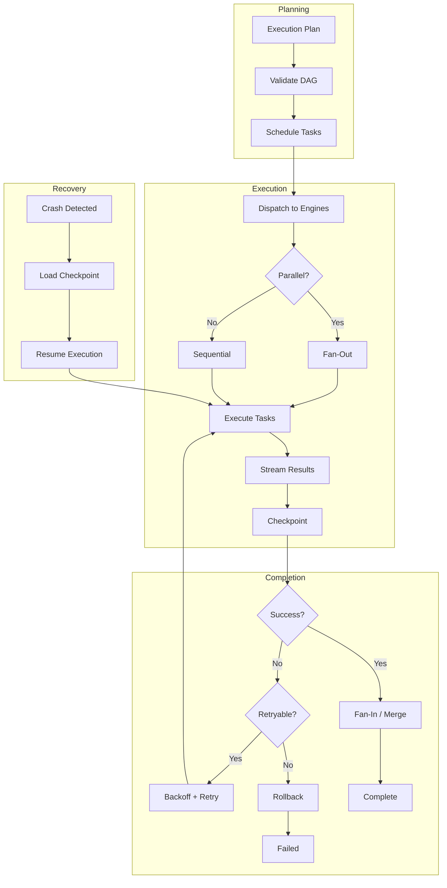

# 10 — Execution Fabric

> The Execution Fabric orchestrates how planned work is actually performed. It manages task graphs, parallel/sequential execution, streaming, retry logic, rollback, checkpointing, and recovery — ensuring reliable, observable, and cancellable execution.

---

## Overview

The Execution Fabric translates an execution plan (a DAG of tasks) into concrete actions, managing their lifecycle from dispatch through completion or failure.

| Property | Description |
|----------|-------------|
| **Graph-based** | Tasks form a DAG with explicit dependencies |
| **Multi-mode** | Sequential, parallel, distributed execution |
| **Resilient** | Automatic retry, rollback, and recovery |
| **Observable** | Real-time streaming of progress and results |
| **Cancellable** | Graceful cancellation at any point |
| **Checkpointed** | Periodic state persistence for crash recovery |

---

## Execution Graph

The execution plan is represented as a Directed Acyclic Graph (DAG).

### Graph Structure

| Component | Description |
|-----------|-------------|
| **Nodes** | Individual tasks with inputs, outputs, and constraints |
| **Edges** | Data or control dependencies between tasks |
| **Entry Nodes** | Tasks with no incoming edges (can start immediately) |
| **Exit Nodes** | Tasks with no outgoing edges (completion signals) |
| **Subgraphs** | Nested DAGs for complex task decomposition |

### Task Node

| Field | Type | Description |
|-------|------|-------------|
| `task_id` | `UUID` | Unique identifier |
| `type` | `TaskType` | compute, io, llm_call, tool_invoke, validation |
| `inputs` | `dict` | Required input data (from upstream or static) |
| `outputs` | `dict` | Produced output data (consumed by downstream) |
| `engine` | `str` | Assigned execution engine |
| `timeout` | `Duration` | Maximum allowed execution time |
| `retry_policy` | `RetryPolicy` | How to handle failures |
| `rollback_action` | `Action | None` | Compensation if rollback needed |
| `checkpoint` | `bool` | Whether to checkpoint after completion |

### Graph Operations

| Operation | Description |
|-----------|-------------|
| `add_task(task)` | Add a task node to the graph |
| `add_dependency(from, to)` | Declare task dependency |
| `validate()` | Check for cycles, unresolved inputs |
| `topological_sort()` | Determine execution order |
| `find_parallel_groups()` | Identify concurrently executable sets |
| `critical_path()` | Calculate longest dependency chain |

---

## Sequential Execution

Ordered task execution with output piping.

### Behavior

- Tasks execute one at a time in dependency order
- Output of task N becomes available as input to task N+1
- Failure halts the chain (unless skip-on-failure configured)
- Progress reported after each task completion

### Output Piping

```text
Task A (output: code) → Task B (input: code, output: tests) → Task C (input: tests)
```

| Pipe Mode | Description |
|-----------|-------------|
| `FULL` | Entire output passed to next task |
| `STREAMING` | Output streamed as produced |
| `TRANSFORM` | Output transformed before passing |
| `SELECTIVE` | Only specified fields passed |

---

## Parallel Execution

Concurrent execution of independent tasks.

### Fan-Out / Fan-In Pattern

```text
                ┌── Task B ──┐
Task A (split) ─┼── Task C ──┼─ Task E (merge)
                └── Task D ──┘
```

| Parameter | Description |
|-----------|-------------|
| `max_parallelism` | Maximum concurrent tasks (default: 4) |
| `fan_out_strategy` | How to split work (by file, by type, by chunk) |
| `fan_in_strategy` | How to merge results (concatenate, reduce, vote) |
| `failure_policy` | fail_fast, collect_all, majority_wins |

### Failure Policies

| Policy | Behavior |
|--------|----------|
| `FAIL_FAST` | Cancel all parallel tasks on first failure |
| `COLLECT_ALL` | Wait for all tasks, report failures at end |
| `MAJORITY_WINS` | Succeed if > 50% of parallel tasks succeed |
| `BEST_EFFORT` | Succeed with whatever completes successfully |

---

## Distributed Execution

Multi-node execution for large-scale workloads.

| Component | Description |
|-----------|-------------|
| **Task Queue** | Distributes tasks across worker nodes |
| **Leader Election** | Consensus-based coordinator selection |
| **Work Stealing** | Idle workers pull tasks from busy workers |
| **Result Aggregation** | Central collector merges distributed results |
| **Heartbeat** | Workers report liveness to coordinator |

### Distribution Criteria

Tasks are distributed based on:
- Resource requirements (GPU, high memory)
- Data locality (process where data resides)
- Engine affinity (specific engine on specific node)
- Load balancing (spread work evenly)

---

## Streaming

Real-time output delivery during execution.

### Streaming Protocols

| Protocol | Use Case | Description |
|----------|----------|-------------|
| **SSE** | Web clients | Server-Sent Events for unidirectional streaming |
| **WebSocket** | Interactive clients | Bidirectional real-time communication |
| **gRPC Stream** | Service-to-service | Efficient binary streaming |
| **Async Iterator** | Internal | In-process streaming |

### Stream Types

| Type | Content | Granularity |
|------|---------|-------------|
| `token_stream` | Generated tokens | Per-token |
| `progress_stream` | Progress updates | Per-milestone |
| `result_stream` | Partial results | Per-task |
| `log_stream` | Execution logs | Per-event |

### Backpressure

- Buffer size: 1000 messages per stream
- Slow consumers: drop oldest messages (configurable)
- Fast producers: rate-limit to consumer speed
- Disconnection: buffer for 30s, then discard

---

## Retry

Automatic retry with configurable strategies.

### Retry Policy

| Parameter | Default | Description |
|-----------|---------|-------------|
| `max_attempts` | 3 | Maximum total attempts |
| `base_delay` | 1s | Initial delay before retry |
| `max_delay` | 30s | Maximum delay cap |
| `backoff` | exponential | Delay growth strategy |
| `jitter` | 0.1 | Random jitter factor (0.0–1.0) |
| `retryable_errors` | [timeout, transient] | Error types that trigger retry |

### Backoff Strategies

| Strategy | Formula | Use Case |
|----------|---------|----------|
| `constant` | `base_delay` | Predictable delays |
| `linear` | `base_delay × attempt` | Gradual increase |
| `exponential` | `base_delay × 2^attempt` | Standard API retry |
| `exponential_jitter` | `(base_delay × 2^attempt) × (1 ± jitter)` | Distributed systems |

### Retry Decision

```text
1. Task fails with error
2. Classify error (retryable vs. terminal)
3. If terminal → mark failed, no retry
4. If retryable:
   a. Check attempt count < max_attempts
   b. Calculate delay with backoff + jitter
   c. Wait for delay
   d. Re-execute task with same inputs
5. If max_attempts exceeded → mark failed, trigger rollback
```

---

## Rollback

Compensation actions to undo partial execution.

### Rollback Strategy

| Strategy | Description |
|----------|-------------|
| **Compensation** | Execute inverse actions (delete created file, revert change) |
| **State Restoration** | Restore from last checkpoint |
| **Hybrid** | Compensate recent actions, restore from older checkpoint |
| **Manual** | Flag for human intervention |

### Compensation Actions

Each task may define a compensation action:

| Task Action | Compensation |
|-------------|-------------|
| Create file | Delete file |
| Modify file | Restore from backup |
| Install package | Uninstall package |
| API call | Reverse API call (if supported) |
| Git commit | Git revert |

### Rollback Protocol

```text
1. Failure detected in task N
2. Determine rollback scope (single task, chain, full graph)
3. Collect completed tasks in reverse order
4. Execute compensation actions sequentially
5. Verify rollback success (state matches pre-execution)
6. Report rollback outcome
```

---

## Checkpoint

Periodic state persistence for resilience.

### Checkpoint Strategy

| Trigger | Description |
|---------|-------------|
| **Periodic** | Every N seconds (configurable, default: 60s) |
| **Milestone** | After significant task completion |
| **Pre-risky** | Before high-risk operations |
| **Manual** | Explicit checkpoint request |

### Checkpoint Contents

| Data | Description |
|------|-------------|
| Execution graph state | Which tasks are done/pending/running |
| Task outputs | Results from completed tasks |
| Working memory | Current context and variables |
| Resource consumption | Budget usage at checkpoint time |
| Stream positions | Where in output streams we are |

### Resume Protocol

```text
1. Load latest valid checkpoint
2. Reconstruct execution graph state
3. Identify tasks completed before checkpoint
4. Skip completed tasks
5. Re-execute interrupted task from beginning
6. Continue with remaining graph
```

---

## Recovery

Crash recovery and orphan cleanup.

### Recovery Scenarios

| Scenario | Detection | Recovery |
|----------|-----------|----------|
| Kernel crash | Heartbeat timeout | Load checkpoint, resume |
| Engine crash | Engine heartbeat loss | Reassign tasks, retry |
| Network partition | Connection timeout | Queue tasks, retry on reconnect |
| Resource exhaustion | OOM/disk full | Checkpoint, pause, alert |
| Deadlock | Progress timeout | Force-cancel, rollback, retry |

### Orphan Cleanup

```text
1. On recovery, scan for orphaned resources:
   - Temporary files without owning task
   - Running processes without parent
   - Locks held by dead processes
2. Wait for grace period (30s)
3. Force-release orphaned resources
4. Log all cleanup actions
```

---

## Scheduling

When tasks execute relative to time and events.

| Schedule Type | Description | Example |
|---------------|-------------|---------|
| `IMMEDIATE` | Execute now | User command |
| `DELAYED` | Execute after duration | "Run in 5 minutes" |
| `CRON` | Recurring schedule | "Every day at 2 AM" |
| `INTERVAL` | Repeating interval | "Every 30 minutes" |
| `EVENT_TRIGGERED` | On specific event | "On file save" |
| `CONDITION` | When condition met | "When tests pass" |

### Scheduler Guarantees

- At-least-once execution for scheduled tasks
- Deduplication for interval-based schedules
- Catch-up policy for missed schedules (run immediately or skip)
- Timezone-aware cron expressions

---

## Cancellation

Graceful task termination with resource cleanup.

### Cancellation Protocol

```text
1. Cancel request received (user or system)
2. Mark task as CANCELLING
3. Send stop signal to executing engine
4. Engine has grace period (default: 10s) to:
   a. Complete current atomic operation
   b. Persist partial results
   c. Release resources
5. If grace period exceeded: force-terminate
6. Execute cleanup actions
7. Mark task as CANCELLED
8. Emit cancellation event
```

### Cancellation Scopes

| Scope | Description |
|-------|-------------|
| `SINGLE_TASK` | Cancel one specific task |
| `SUBTREE` | Cancel task and all downstream dependents |
| `FULL_GRAPH` | Cancel entire execution graph |
| `SESSION` | Cancel all tasks in a session |

---

## Execution Flow Diagram



---

*Next: [11 — Verification Fabric](./11-verification-fabric.md)*
