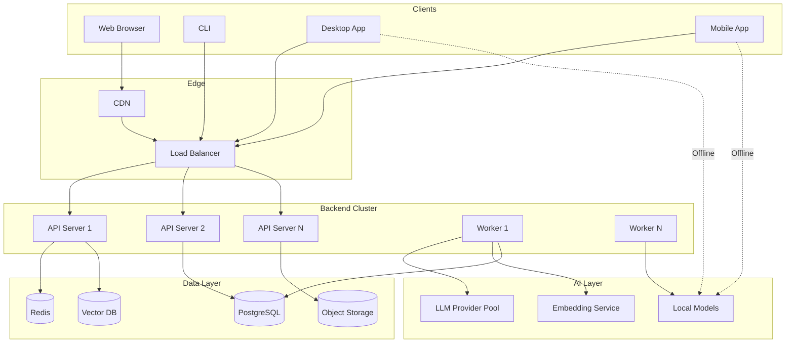

# 14 — Deployment Architecture

> The Deployment Architecture defines how Sona AI OS is packaged, distributed, and operated across multiple platforms — from cloud-native microservices to offline-capable desktop and mobile applications.

---

## Overview

Sona AI OS supports multiple deployment modes to serve diverse use cases:

| Mode | Primary Use Case | Network Required |
|------|-----------------|------------------|
| **Cloud** | Teams, enterprise, multi-user | Always |
| **Offline** | Privacy-first, air-gapped, travel | Never |
| **Hybrid** | Best of both — local inference + cloud APIs | Optional |

---

## Backend (FastAPI)

### Architecture

| Component | Technology | Purpose |
|-----------|-----------|---------|
| API Framework | FastAPI | Async HTTP/WebSocket server |
| Task Queue | Celery + Redis | Background task processing |
| Database | PostgreSQL | Primary data store |
| Cache | Redis | Session, rate limiting, pub/sub |
| Search | pgvector + FTS5 | Vector + keyword search |
| Object Storage | S3-compatible | File attachments, exports |

### Containerization

| Aspect | Details |
|--------|---------|
| Base image | `python:3.12-slim` |
| Multi-stage build | Build → Test → Production |
| Image size target | < 500 MB |
| Health check | `/health` endpoint |
| Graceful shutdown | SIGTERM handling with drain |

### Horizontal Scaling

| Component | Scaling Strategy | Metric |
|-----------|-----------------|--------|
| API servers | Horizontal (stateless) | Request rate |
| Task workers | Horizontal (queue depth) | Queue size |
| Database | Vertical + read replicas | Connection count |
| Cache | Clustered Redis | Memory usage |
| Vector search | Horizontal (sharded) | Query latency |

### Deployment Configuration

| Environment | Instances | Resources | Purpose |
|-------------|-----------|-----------|---------|
| Development | 1 | 2 CPU, 4 GB | Local development |
| Staging | 2 | 4 CPU, 8 GB | Integration testing |
| Production | 3+ | 8 CPU, 16 GB | User-facing |

---

## Frontend (React SPA)

### Architecture

| Component | Technology | Purpose |
|-----------|-----------|---------|
| Framework | React 18+ | UI rendering |
| State Management | Zustand | Client state |
| Server State | TanStack Query | API data fetching |
| Styling | Tailwind CSS | Utility-first CSS |
| Build Tool | Vite | Fast builds, HMR |
| Router | React Router | Client-side routing |

### CDN Delivery

| Aspect | Configuration |
|--------|---------------|
| CDN provider | Configurable (CloudFront, Cloudflare) |
| Cache policy | Immutable assets (hashed filenames) |
| Cache duration | 1 year for hashed assets, 5 min for index.html |
| Compression | Brotli + gzip |
| Edge locations | Global |

### Code Splitting

| Strategy | Description |
|----------|-------------|
| Route-based | Each route loads its own bundle |
| Feature-based | Large features loaded on demand |
| Vendor splitting | Third-party libs in separate chunk |
| Prefetching | Likely next-routes prefetched on idle |

### Bundle Size Targets

| Asset | Target | Budget |
|-------|--------|--------|
| Initial JS | < 150 KB (gzipped) | Hard limit |
| Initial CSS | < 30 KB (gzipped) | Hard limit |
| Largest route chunk | < 50 KB | Warning at 40 KB |
| Total (all routes) | < 500 KB | Advisory |

---

## Android (Kotlin + Jetpack Compose)

### Architecture

| Layer | Technology | Purpose |
|-------|-----------|---------|
| UI | Jetpack Compose | Declarative UI |
| Navigation | Compose Navigation | Screen flow |
| DI | Hilt | Dependency injection |
| Networking | Retrofit + OkHttp | API communication |
| Local DB | Room | Offline data storage |
| AI (on-device) | ONNX Runtime | Local model inference |

### Offline Capability

| Feature | Offline Behavior |
|---------|------------------|
| Conversations | Queue messages, sync when online |
| Code analysis | Local model for basic analysis |
| Memory | Local Room database |
| File access | Cached project snapshots |
| Search | Local FTS index |

### Build and Distribution

| Aspect | Details |
|--------|---------|
| Min SDK | API 26 (Android 8.0) |
| Target SDK | Latest stable |
| Build system | Gradle (Kotlin DSL) |
| CI/CD | GitHub Actions → Play Store |
| App size target | < 50 MB (without models) |
| Model download | On-demand, user-selectable |

---

## Desktop (Tauri)

### Architecture

| Component | Technology | Purpose |
|-----------|-----------|---------|
| Shell | Tauri 2.0 | Native window, system APIs |
| Frontend | Shared React SPA | UI (reused from web) |
| Backend | Rust | Native performance, system access |
| IPC | Tauri commands | Frontend ↔ backend |
| Updates | Tauri updater | Auto-update mechanism |

### Cross-Platform Support

| Platform | Architecture | Installer |
|----------|-------------|-----------|
| macOS | x86_64 + ARM64 (Universal) | .dmg |
| Windows | x86_64 + ARM64 | .msi / .exe |
| Linux | x86_64 + ARM64 | .AppImage / .deb |

### Native Performance

| Optimization | Description |
|--------------|-------------|
| Webview | System webview (no bundled Chromium) |
| Memory | < 100 MB baseline |
| Startup | < 2 seconds cold start |
| Binary size | < 20 MB (without models) |

---

## CLI

### Architecture

| Aspect | Details |
|--------|---------|
| Language | Rust (compiled binary) |
| Parser | clap |
| Output | JSON, table, plain text (configurable) |
| Config | TOML file (~/.sona/config.toml) |
| Auth | Token-based (stored in keyring) |

### CI-Friendly Features

| Feature | Description |
|---------|-------------|
| Non-interactive mode | All options via flags/env vars |
| Exit codes | Semantic exit codes for scripting |
| JSON output | Machine-parseable output mode |
| Pipe support | stdin/stdout for Unix pipelines |
| Quiet mode | Suppress non-essential output |
| Timeout control | Configurable per-command |

### Distribution

| Method | Platform |
|--------|----------|
| Homebrew | macOS, Linux |
| Chocolatey | Windows |
| Cargo install | Cross-platform |
| Direct download | GitHub releases |
| Docker | Any (containerized) |

---

## Offline Mode

### Architecture

| Component | Offline Alternative |
|-----------|-------------------|
| LLM inference | Local models (GGUF via llama.cpp) |
| Vector search | SQLite + custom HNSW |
| Database | SQLite |
| File storage | Local filesystem |
| Sync | Queue + reconcile on connect |

### Local Models

| Model Size | RAM Required | Capability |
|------------|-------------|------------|
| 1B params | 2 GB | Basic completion, simple tasks |
| 7B params | 8 GB | Good code generation, reasoning |
| 13B params | 16 GB | Advanced analysis, planning |
| 70B params | 48 GB+ | Near-cloud quality |

### Sync-on-Connect

```text
1. Detect network availability
2. Queue all operations during offline period
3. On reconnection:
   a. Push local changes to cloud
   b. Pull remote changes
   c. Resolve conflicts (last-write-wins or user choice)
   d. Sync memory updates
   e. Update capability registry
```

---

## Cloud Mode

### Managed Services

| Service | Purpose | Provider-Agnostic |
|---------|---------|-------------------|
| Compute | API servers, workers | Kubernetes |
| Database | PostgreSQL | Any managed PG |
| Cache | Redis | Any managed Redis |
| Object Storage | Files, models | S3-compatible |
| CDN | Frontend delivery | Any CDN |
| Monitoring | Metrics, logs, traces | OpenTelemetry |

### Auto-Scaling

| Component | Metric | Scale Up | Scale Down |
|-----------|--------|----------|------------|
| API | CPU > 70% | +1 instance | CPU < 30% for 10m |
| Workers | Queue > 20 | +1 worker | Queue = 0 for 5m |
| Vector DB | Latency > 100ms | +1 replica | Latency < 20ms |

### Multi-Region

| Tier | Regions | Data Replication |
|------|---------|------------------|
| Single | 1 | None |
| HA | 2 | Active-passive |
| Global | 3+ | Active-active (eventual consistency) |

---

## Hybrid Mode

### Intelligent Routing

Requests are routed based on:

| Factor | Route Local | Route Cloud |
|--------|-------------|-------------|
| Model size needed | Small model sufficient | Large model required |
| Network available | Offline | Online |
| Latency requirement | Ultra-low latency | Can tolerate latency |
| Privacy sensitivity | Contains PII/secrets | General queries |
| Cost optimization | Free (local compute) | Budget available |
| Task complexity | Simple tasks | Complex reasoning |

### Routing Decision

```text
1. Classify request (complexity, sensitivity, size)
2. Check network availability
3. Check local model capability
4. If local sufficient AND (offline OR sensitive OR simple):
   → Route to local model
5. Else if cloud available AND budget remaining:
   → Route to cloud provider
6. Else:
   → Queue for later OR degrade gracefully
```

---

## Infrastructure Diagram



---

*Next: [15 — Quality Attributes](./15-quality-attributes.md)*
