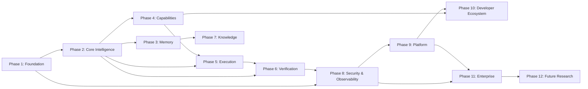

# 17 — Implementation Roadmap

> The Implementation Roadmap defines the phased delivery plan for Sona AI OS, from foundational infrastructure through enterprise features. Each phase builds on the previous, with clear validation gates and acceptance criteria.

---

## Overview

| Phase | Name | Estimated Complexity | Dependencies |
|-------|------|---------------------|--------------|
| 1 | Foundation | L | None |
| 2 | Core Intelligence | XL | Phase 1 |
| 3 | Memory | XL | Phase 2 |
| 4 | Capabilities | L | Phase 2 |
| 5 | Execution | L | Phases 2, 4 |
| 6 | Verification | XL | Phases 2, 5 |
| 7 | Knowledge | XL | Phase 3 |
| 8 | Security & Observability | L | Phases 1–6 |
| 9 | Platform | L | Phases 1–8 |
| 10 | Developer Ecosystem | M | Phases 4, 9 |
| 11 | Enterprise | L | Phases 8, 9 |
| 12 | Future Research | XL | All phases |

---

## Phase 1: Foundation

> Establish the architectural scaffolding that all subsequent phases build upon.

### Objectives

- Implement the Cognitive Kernel scaffold with state machine
- Define and enforce engine interface contracts
- Build the event bus for system-wide communication
- Establish project structure and engineering standards

### Deliverables

| Deliverable | Description |
|-------------|-------------|
| Kernel state machine | Full lifecycle (STARTING → READY → PROCESSING → PAUSED → SHUTTING_DOWN) |
| Engine interface protocol | Abstract base with prepare/execute/cancel/health |
| Event bus | Typed publish-subscribe with filtering |
| Configuration system | Hierarchical config with env var override |
| Project scaffolding | Package structure, CI/CD, linting, formatting |
| Domain models | Core dataclasses (Request, Response, Goal, Task) |

### Dependencies

- None (first phase)

### Validation Gates

- [ ] Kernel transitions through all states correctly
- [ ] Engine interface is implementable with a mock engine
- [ ] Events are published and received within 10 ms
- [ ] Full test suite passes with > 80% coverage
- [ ] CI/CD pipeline operational (lint, type-check, test)

### Acceptance Criteria

- Kernel can accept, process (with mock engine), and complete a request
- State machine rejects invalid transitions
- Events are strongly typed and documented
- All code passes mypy strict + ruff

### Risks

| Risk | Probability | Impact | Mitigation |
|------|-------------|--------|------------|
| Over-engineering interfaces | Medium | Medium | Start minimal, iterate |
| Event bus performance | Low | High | Benchmark early |

### Estimated Complexity: **L**

---

## Phase 2: Core Intelligence

> Implement the cognitive engines that give the system its intelligence.

### Objectives

- Build intent classification and goal decomposition
- Implement context assembly from available memory
- Build thinking engine (chain-of-thought, reflection)
- Implement reasoning engine (planning, evaluation)
- Wire engines into the kernel coordination protocol

### Deliverables

| Deliverable | Description |
|-------------|-------------|
| Intent Engine | Classifies user intent, extracts entities and constraints |
| Goal Manager | Lifecycle, prioritization, scheduling, dependency management |
| Context Engine | Assembles optimal context from available sources |
| Thinking Engine | Chain-of-thought, step-back, reflection strategies |
| Reasoning Engine | Plan generation, evaluation, selection |
| LLM Provider Interface | Abstraction over multiple LLM providers |

### Dependencies

- Phase 1 (kernel, engine interface, event bus)

### Validation Gates

- [ ] Intent classification accuracy > 90% on test suite
- [ ] Goal decomposition produces valid sub-goal DAGs
- [ ] Context assembly respects token budgets
- [ ] Thinking engine produces traceable reasoning chains
- [ ] LLM provider switchable without code changes

### Acceptance Criteria

- System can take a natural language request, classify intent, create a goal, plan execution, and produce a response
- End-to-end latency < 5s for simple requests
- Provider failover works within 10s

### Risks

| Risk | Probability | Impact | Mitigation |
|------|-------------|--------|------------|
| LLM quality variance | High | Medium | Multi-provider with fallback |
| Intent ambiguity | Medium | Medium | Clarification dialog |
| Context window limits | Medium | High | Aggressive summarization |

### Estimated Complexity: **XL**

---

## Phase 3: Memory

> Build the multi-tier memory system for context retention and learning.

### Objectives

- Implement working memory with token-budgeted eviction
- Build conversation and session memory with summarization
- Implement semantic memory with embedding-based retrieval
- Build vector memory infrastructure
- Implement memory consolidation (promotion, demotion, deduplication)

### Deliverables

| Deliverable | Description |
|-------------|-------------|
| Working Memory | Token-budgeted scratchpad with LRU+importance eviction |
| Conversation Memory | Turn storage with rolling summarization |
| Session Memory | Cross-conversation state persistence |
| Semantic Memory | Fact store with embedding-based retrieval |
| Vector Memory | HNSW-indexed embedding store |
| Memory Consolidation | Scheduled compression, promotion, deduplication |
| Context Assembly v2 | Multi-source retrieval with ranking |

### Dependencies

- Phase 2 (context engine, LLM provider for embeddings)

### Validation Gates

- [ ] Working memory respects token budgets within 5% tolerance
- [ ] Conversation summarization preserves key information
- [ ] Vector search returns relevant results (MRR > 0.7)
- [ ] Consolidation reduces storage by > 30% without information loss
- [ ] Memory retrieval < 50 ms p95

### Acceptance Criteria

- System remembers context across turns within a conversation
- System recalls relevant past interactions in new sessions
- Memory scales to 10M entries per project without degradation
- Token budget is never exceeded

### Risks

| Risk | Probability | Impact | Mitigation |
|------|-------------|--------|------------|
| Embedding quality | Medium | High | Benchmark multiple models |
| Storage growth | High | Medium | Aggressive consolidation |
| Retrieval relevance | Medium | High | Hybrid search + reranking |

### Estimated Complexity: **XL**

---

## Phase 4: Capabilities

> Build the plugin system that makes the AI extensible.

### Objectives

- Implement capability registry with discovery
- Build plugin SDK with clear interface contracts
- Implement sandbox isolation for capability execution
- Build capability health monitoring
- Create initial built-in capabilities (file ops, git, shell)

### Deliverables

| Deliverable | Description |
|-------------|-------------|
| Capability Registry | Registration, discovery, version management |
| Plugin SDK | Interface contracts, manifest schema, packaging |
| Sandbox | Filesystem, network, and resource isolation |
| Health Monitor | Heartbeat, circuit breaker, auto-recovery |
| Built-in Capabilities | File operations, git, shell, HTTP |
| Capability Lifecycle | DISCOVERED → LOADED → ACTIVE → SUSPENDED → UNLOADED |

### Dependencies

- Phase 2 (kernel coordination, execution context)

### Validation Gates

- [ ] Third-party plugin installable without system restart
- [ ] Sandbox prevents unauthorized filesystem access
- [ ] Health monitor detects and recovers from capability failures
- [ ] Plugin SDK documented with working examples
- [ ] Capability loading < 500 ms

### Acceptance Criteria

- New capability implementable in < 30 minutes using SDK
- Sandbox escape impossible (verified by security review)
- Health monitoring triggers circuit breaker on sustained errors
- Hot-reload works without dropping in-flight requests

### Risks

| Risk | Probability | Impact | Mitigation |
|------|-------------|--------|------------|
| Sandbox escape | Low | Critical | Defense in depth, security audit |
| Plugin compatibility | Medium | Medium | SemVer + compatibility matrix |
| Performance overhead | Medium | Medium | Lazy loading, pooling |

### Estimated Complexity: **L**

---

## Phase 5: Execution

> Build reliable, observable execution of planned work.

### Objectives

- Implement execution graph (DAG) with dependency resolution
- Build parallel execution with fan-out/fan-in
- Implement retry with exponential backoff and jitter
- Build checkpoint and recovery system
- Implement streaming output delivery

### Deliverables

| Deliverable | Description |
|-------------|-------------|
| Execution Graph | DAG construction, validation, scheduling |
| Sequential Executor | Ordered execution with output piping |
| Parallel Executor | Concurrent tasks with configurable policies |
| Retry Engine | Exponential backoff, jitter, max attempts |
| Checkpoint System | Periodic state persistence, resume from failure |
| Streaming | SSE + WebSocket output delivery |
| Cancellation | Graceful stop with resource cleanup |
| Rollback | Compensation actions for failed executions |

### Dependencies

- Phase 2 (goal management, planning)
- Phase 4 (capabilities as execution targets)

### Validation Gates

- [ ] DAG cycle detection prevents invalid graphs
- [ ] Parallel execution respects concurrency limits
- [ ] Retry honors max attempts and backoff timing
- [ ] Checkpoint + crash → resume produces correct results
- [ ] Streaming first-token latency < 1s
- [ ] Cancellation completes within 10s grace period

### Acceptance Criteria

- Multi-step plans execute reliably with proper dependency ordering
- System recovers from crash mid-execution within 30s
- Streaming works for all output types (text, code, structured)
- Rollback restores pre-execution state

### Risks

| Risk | Probability | Impact | Mitigation |
|------|-------------|--------|------------|
| Checkpoint storage growth | Medium | Low | Expiration policy |
| Rollback incompleteness | Medium | High | Compensation testing |
| Streaming backpressure | Medium | Medium | Buffer + drop policy |

### Estimated Complexity: **L**

---

## Phase 6: Verification

> Build the 10 verification pipelines for output quality assurance.

### Objectives

- Implement all 10 verification pipelines
- Build confidence scoring and aggregation
- Implement veto mechanism and auto-remediation
- Build verification trace for auditability
- Tune thresholds based on real-world usage

### Deliverables

| Deliverable | Description |
|-------------|-------------|
| Security Pipeline | Injection, secrets, unsafe operations detection |
| Logic Pipeline | Correctness, edge cases, type safety |
| Architecture Pipeline | Dependency rules, coupling, layer violations |
| Reasoning Pipeline | Logical validity, evidence quality |
| Performance Pipeline | Complexity, resource usage analysis |
| Consistency Pipeline | State coherence, contract compliance |
| Compliance Pipeline | Policy, license, regulatory checks |
| Risk Pipeline | Blast radius, reversibility assessment |
| Cost Pipeline | Budget tracking, waste detection |
| Hallucination Pipeline | Fact grounding, source verification |
| Orchestrator | Parallel execution, veto, confidence aggregation |

### Dependencies

- Phase 2 (reasoning engine for analysis)
- Phase 5 (execution output to verify)

### Validation Gates

- [ ] Security pipeline catches OWASP Top 10 injections
- [ ] Hallucination detection identifies fabricated APIs
- [ ] Veto correctly blocks unsafe outputs
- [ ] All pipelines complete within 3s total
- [ ] False positive rate < 5%
- [ ] False negative rate < 2% for critical issues

### Acceptance Criteria

- No high-severity security issue passes verification
- Confidence scores correlate with actual output quality
- Auto-remediation fixes > 60% of verification failures
- Verification trace provides complete audit for every output

### Risks

| Risk | Probability | Impact | Mitigation |
|------|-------------|--------|------------|
| False positives (user friction) | High | Medium | Tunable thresholds |
| Verification latency | Medium | Medium | Parallel + caching |
| Hallucination detection accuracy | High | High | Multi-method ensemble |

### Estimated Complexity: **XL**

---

## Phase 7: Knowledge

> Build RAG, GraphRAG, and hybrid search for knowledge-grounded responses.

### Objectives

- Implement full RAG pipeline (embed → retrieve → rank → augment → cite)
- Build Knowledge Graph with entity extraction
- Implement hybrid search (vector + keyword + graph)
- Build citation engine with source tracking
- Implement knowledge validation and staleness detection

### Deliverables

| Deliverable | Description |
|-------------|-------------|
| RAG Pipeline | End-to-end retrieval-augmented generation |
| GraphRAG | Entity extraction, graph traversal, context enrichment |
| Hybrid Search | Configurable vector + keyword + graph fusion |
| Semantic Search | Cross-encoder reranking, MMR diversity |
| Keyword Search | BM25, FTS5, trigram matching |
| Citation Engine | Source tracking, attribution, confidence |
| Knowledge Validator | Fact-checking, staleness detection |
| Code Graph | AST-based code structure indexing |

### Dependencies

- Phase 3 (vector memory, embedding infrastructure)

### Validation Gates

- [ ] RAG improves response accuracy by > 20% vs. no retrieval
- [ ] Hybrid search outperforms single-mode search (MRR comparison)
- [ ] Citations trace back to valid, accessible sources
- [ ] Knowledge validation detects > 80% of stale information
- [ ] Indexing is incremental (< 5s for single file change)

### Acceptance Criteria

- Responses are grounded in verifiable sources
- Citations are accurate and linked to source material
- Hybrid search adapts weights based on query type
- Stale knowledge is detected and flagged

### Risks

| Risk | Probability | Impact | Mitigation |
|------|-------------|--------|------------|
| Index size scalability | Medium | Medium | Sharding, pruning |
| Retrieval relevance | Medium | High | Continuous evaluation |
| Citation accuracy | Medium | High | Multi-source verification |

### Estimated Complexity: **XL**

---

## Phase 8: Security & Observability

> Harden the system with production-grade security and monitoring.

### Objectives

- Implement authentication (JWT, API keys, refresh tokens)
- Build RBAC authorization with permission granularity
- Implement secrets management with vault integration
- Build comprehensive metrics, tracing, and logging
- Implement audit trail with tamper detection

### Deliverables

| Deliverable | Description |
|-------------|-------------|
| Authentication | JWT + refresh tokens + API keys |
| Authorization | RBAC with resource-level permissions |
| Secrets Management | Vault integration, rotation, env-based |
| Encryption | At-rest, in-transit, field-level |
| Audit Trail | Immutable, hash-chained event log |
| Metrics | Prometheus-compatible, AI-specific metrics |
| Tracing | OpenTelemetry distributed tracing |
| Logging | Structured JSON with correlation IDs |
| Health Checks | Liveness, readiness, startup probes |
| Rate Limiting | Sliding window, per-user, per-endpoint |

### Dependencies

- Phases 1–6 (system must be functional before hardening)

### Validation Gates

- [ ] Authentication rejects invalid/expired tokens
- [ ] RBAC correctly denies unauthorized access
- [ ] Secrets never appear in logs or traces
- [ ] All requests have trace IDs end-to-end
- [ ] Audit trail is tamper-evident (hash chain verified)
- [ ] Rate limiting correctly throttles excess requests

### Acceptance Criteria

- Zero high-severity vulnerabilities in security audit
- 100% of requests traced and logged
- Secrets rotation causes zero downtime
- Alert latency < 1 minute for critical issues

### Risks

| Risk | Probability | Impact | Mitigation |
|------|-------------|--------|------------|
| Performance overhead | Medium | Medium | Async, sampling |
| Configuration complexity | Medium | Low | Sensible defaults |
| Vault availability | Low | High | Cached secrets with TTL |

### Estimated Complexity: **L**

---

## Phase 9: Platform

> Build user-facing interfaces across all target platforms.

### Objectives

- Build web dashboard (React SPA)
- Build CLI tool (Rust binary)
- Build desktop application (Tauri)
- Build mobile application (Android, Kotlin + Compose)
- Ensure consistent experience across platforms

### Deliverables

| Deliverable | Description |
|-------------|-------------|
| Web Dashboard | React SPA with chat, goals, memory, settings |
| CLI | Rust binary with scriptable interface |
| Desktop App | Tauri cross-platform application |
| Android App | Kotlin + Jetpack Compose with offline support |
| Shared Design System | Component library, tokens, guidelines |
| Platform SDK | Client libraries for platform integration |

### Dependencies

- Phases 1–8 (full backend must be operational)

### Validation Gates

- [ ] Web dashboard loads in < 3s (first paint)
- [ ] CLI responds in < 1s for non-AI commands
- [ ] Desktop app starts in < 2s (cold start)
- [ ] Android app works fully offline
- [ ] All platforms pass accessibility audit
- [ ] Consistent behavior verified across platforms

### Acceptance Criteria

- Users can complete all core flows on every platform
- Offline mode provides meaningful functionality
- Cross-platform state sync works correctly
- Platform-specific features leverage native capabilities

### Risks

| Risk | Probability | Impact | Mitigation |
|------|-------------|--------|------------|
| Platform fragmentation | High | Medium | Shared design system |
| Offline sync conflicts | Medium | Medium | Conflict resolution UX |
| Mobile performance | Medium | Medium | Optimized local models |

### Estimated Complexity: **L**

---

## Phase 10: Developer Ecosystem

> Build tools and infrastructure for third-party developers.

### Objectives

- Launch capability marketplace
- Publish comprehensive SDK documentation
- Build developer portal with tutorials
- Implement capability certification pipeline
- Build community contribution workflow

### Deliverables

| Deliverable | Description |
|-------------|-------------|
| Marketplace | Publish, search, install, rate capabilities |
| SDK Documentation | Complete API reference, guides, examples |
| Developer Portal | Tutorials, playground, community forum |
| Certification Pipeline | Automated quality and security checks |
| Contribution Workflow | Issue templates, PR guidelines, CLA |
| Example Capabilities | Reference implementations for each type |

### Dependencies

- Phase 4 (capability fabric, plugin SDK)
- Phase 9 (web platform for marketplace UI)

### Validation Gates

- [ ] Third-party developer can publish a capability in < 1 hour
- [ ] SDK documentation covers 100% of public APIs
- [ ] Certification catches > 90% of quality issues
- [ ] Marketplace search returns relevant results
- [ ] Example capabilities pass all quality gates

### Acceptance Criteria

- External developers can build and publish capabilities
- Marketplace provides meaningful discovery and trust signals
- SDK is self-serve (no support needed for basic usage)
- Community contributions are reviewed within 3 business days

### Risks

| Risk | Probability | Impact | Mitigation |
|------|-------------|--------|------------|
| Low adoption | Medium | Medium | Developer advocacy, incentives |
| Malicious plugins | Medium | High | Security scanning, sandboxing |
| API stability | Medium | Medium | Versioning, deprecation policy |

### Estimated Complexity: **M**

---

## Phase 11: Enterprise

> Add features required for enterprise adoption.

### Objectives

- Implement multi-user and team collaboration
- Build organization management and billing
- Implement compliance features (SOC2, GDPR readiness)
- Build admin dashboard for organization management
- Implement SSO integration (SAML, OIDC)

### Deliverables

| Deliverable | Description |
|-------------|-------------|
| Multi-User | User management, profiles, preferences |
| Team Features | Shared projects, collaborative memory, team roles |
| Organization Management | Org creation, member management, billing |
| SSO Integration | SAML 2.0, OpenID Connect |
| Compliance | SOC2 controls, GDPR data handling, audit reports |
| Admin Dashboard | User management, usage analytics, policy configuration |
| Data Residency | Region-specific data storage options |

### Dependencies

- Phase 8 (security, authentication, RBAC)
- Phase 9 (web platform for admin UI)

### Validation Gates

- [ ] Multi-user isolation verified (no cross-user data leakage)
- [ ] SSO login flow works with major providers
- [ ] GDPR data export produces complete user data
- [ ] GDPR data deletion removes all user traces
- [ ] Billing accurately tracks usage per organization
- [ ] Admin can manage users, roles, and policies

### Acceptance Criteria

- Teams can collaborate on shared projects
- Organizations can manage members and enforce policies
- Compliance requirements met for SOC2 Type I
- Data residency choices enforced at infrastructure level

### Risks

| Risk | Probability | Impact | Mitigation |
|------|-------------|--------|------------|
| Data isolation failure | Low | Critical | Tenant isolation testing |
| Compliance complexity | High | Medium | Compliance-as-code |
| Multi-tenant performance | Medium | Medium | Per-tenant resource limits |

### Estimated Complexity: **L**

---

## Phase 12: Future Research

> Explore advanced capabilities that push the boundaries of AI assistance.

### Objectives

- Research self-improvement through experience learning
- Explore autonomous agent capabilities
- Investigate multi-agent collaboration
- Research adaptive reasoning strategies
- Explore emergent behavior management

### Deliverables

| Deliverable | Description |
|-------------|-------------|
| Self-Improvement Engine | Learning from outcomes to improve future performance |
| Autonomous Agents | Long-running agents with goal pursuit |
| Multi-Agent Collaboration | Agents cooperating on complex tasks |
| Adaptive Strategies | Dynamic reasoning strategy selection |
| Safety Framework | Guardrails for autonomous behavior |
| Research Papers | Documented findings and contributions |

### Dependencies

- All previous phases (mature, stable system required)

### Validation Gates

- [ ] Self-improvement measurably increases success rate
- [ ] Autonomous agents operate within defined safety bounds
- [ ] Multi-agent collaboration produces better outcomes than single-agent
- [ ] Safety framework prevents unauthorized autonomous actions
- [ ] All research is reproducible with documented methodology

### Acceptance Criteria

- Measurable improvement in system performance over time
- Autonomous agents can complete multi-hour tasks safely
- Multi-agent collaboration handles complex cross-domain work
- Safety bounds are never violated in testing

### Risks

| Risk | Probability | Impact | Mitigation |
|------|-------------|--------|------------|
| Uncontrolled behavior | Medium | Critical | Safety bounds, kill switches |
| Reward hacking | Medium | High | Multi-metric evaluation |
| Capability overhang | Low | High | Gradual capability release |
| Ethical concerns | Medium | High | Ethics review board |

### Estimated Complexity: **XL**

---

## Phase Dependencies Diagram

---

## Summary

| Phase | Complexity | Key Risk | Critical Path |
|-------|-----------|----------|---------------|
| 1. Foundation | L | Over-engineering | Yes |
| 2. Core Intelligence | XL | LLM quality variance | Yes |
| 3. Memory | XL | Retrieval relevance | Yes |
| 4. Capabilities | L | Sandbox escape | No |
| 5. Execution | L | Rollback incompleteness | Yes |
| 6. Verification | XL | False positive rate | Yes |
| 7. Knowledge | XL | Index scalability | No |
| 8. Security | L | Vault availability | Yes |
| 9. Platform | L | Platform fragmentation | No |
| 10. Ecosystem | M | Low adoption | No |
| 11. Enterprise | L | Data isolation | No |
| 12. Research | XL | Uncontrolled behavior | No |

---

*End of Blueprint*
